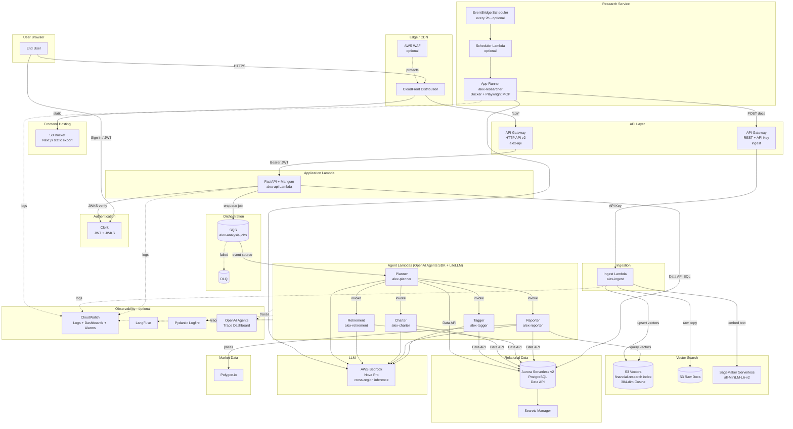
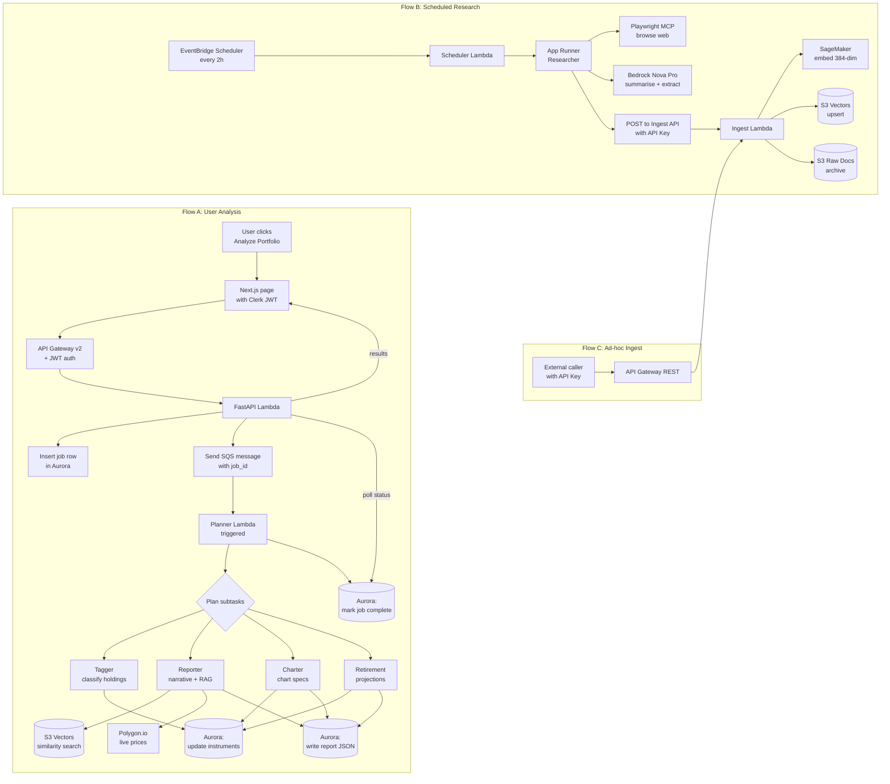
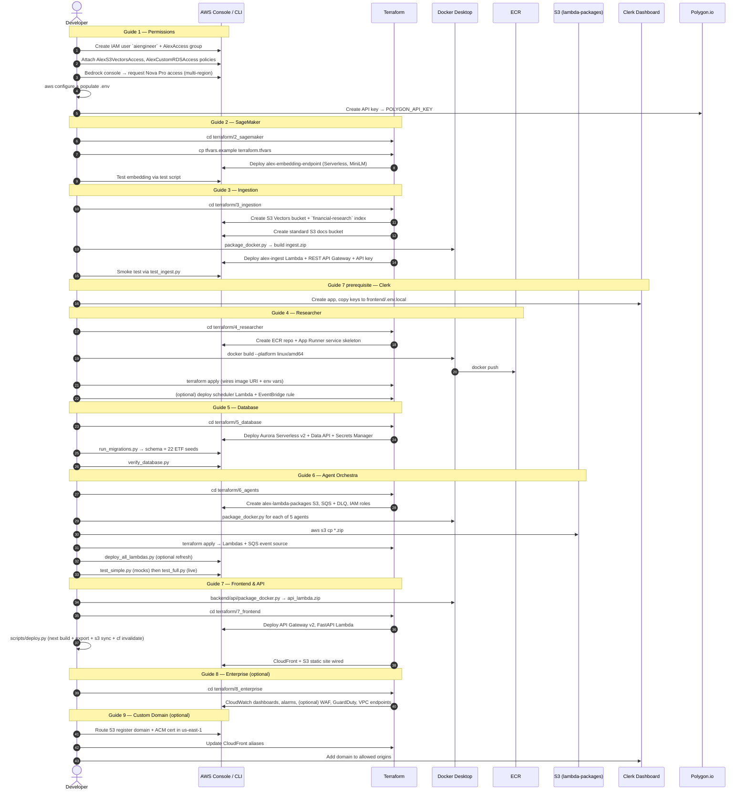
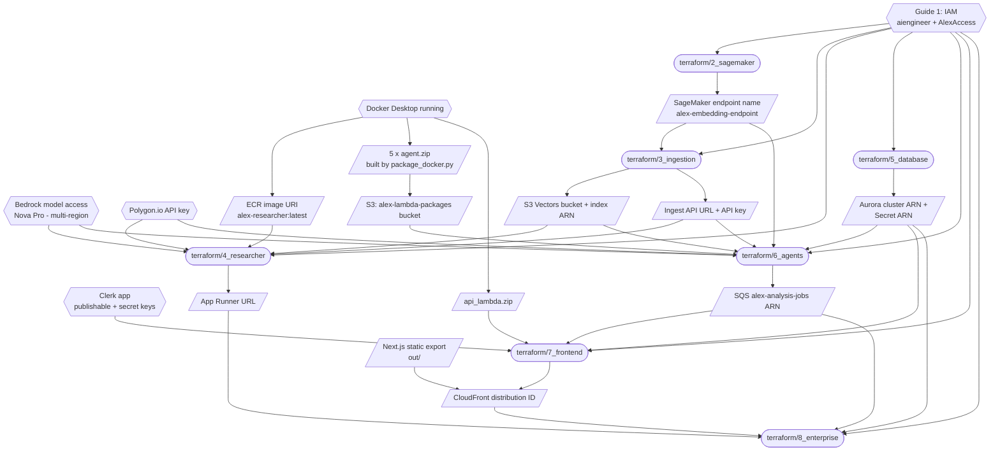

# Agentic RAG Financial Planner

The **Agentic RAG Financial Planner** is a multi-agent, enterprise-grade SaaS financial planning platform. It analyses users' equity portfolios through a coordinated team of specialised AI agents and produces narrative reports, interactive charts, retirement projections, and up-to-date market research — all backed by retrieval-augmented generation (RAG) against a curated vector index of financial knowledge (pulled from real-time Polygon AI API).

Access the website here: https://www.darren-agentic-financial-advisor.click/

---

## Table of Contents

1. [Tech Stack](#tech-stack)
2. [Architecture Diagram](#architecture-diagram)
3. [Data Flow Diagram](#data-flow-diagram)
4. [Build and Deployment Sequence Diagram](#build-and-deployment-sequence-diagram)
5. [Build Dependencies Diagram](#build-dependencies-diagram)
6. [Assumptions & Notes](#assumptions--notes)

---

## Tech Stack

### Frontend
- **Next.js 15** (Pages Router, TypeScript)
- **React 18**
- **Tailwind CSS** for styling
- **Recharts** for portfolio / retirement charting
- **Clerk** for authentication (JWT + JWKS verification)
- **CloudFront** CDN + **S3** static hosting

### Backend / Application Layer
- **FastAPI** + **Mangum** adapter running on AWS Lambda (`alex-api`)
- **API Gateway HTTP API (v2)** fronting the FastAPI Lambda
- **API Gateway REST API** (separate, API-key protected) fronting the ingest Lambda
- Agents written against the **OpenAI Agents SDK** (`openai-agents`) with `Runner` / `Agent` / `trace`
- **LiteLLM** (`LitellmModel(model=f"bedrock/{model_id}")`) bridging Agents SDK → Bedrock
- **Python 3.12**, dependency management via **uv**

### AI / ML
- **AWS Bedrock** — **Amazon Nova Pro** (`us.amazon.nova-pro-v1:0` or `eu.amazon.nova-pro-v1:0`) via cross-region inference profiles
- **Amazon SageMaker Serverless Inference** — embedding endpoint `alex-embedding-endpoint` hosting HuggingFace `sentence-transformers/all-MiniLM-L6-v2` (384-dim)
- **Playwright MCP server** (headless browser) used as a tool by the Researcher agent
- **OpenAI Agents SDK tracing** (requires `OPENAI_API_KEY` for the trace dashboard)

### Agents (5 Lambda + 1 App Runner)
- **Planner** (`alex-planner`) — orchestrator, SQS-triggered
- **Tagger** (`alex-tagger`) — classifies instruments (ETF / stock / sector etc.)
- **Reporter** (`alex-reporter`) — narrative portfolio report (uses context-aware tools)
- **Charter** (`alex-charter`) — structured chart specs for Recharts
- **Retirement** (`alex-retirement`) — Monte-Carlo / projection specialist
- **Researcher** (`alex-researcher`) — long-running, autonomous web researcher on **AWS App Runner** (Docker, linux/amd64), writes vectors back through the ingest API

### Data & Storage
- **Aurora Serverless v2 PostgreSQL** (`alex-aurora-cluster`) with **Data API enabled** (no VPC required)
  - Tables: `users`, `instruments`, `accounts`, `positions`, `jobs`
  - Seeded with 22 ETFs
- **Amazon S3 Vectors** — native vector bucket `alex-vectors-{account_id}`, index `financial-research`, 384 dims, Cosine distance (~90% cheaper than OpenSearch)
- **S3 standard bucket** for raw ingested documents (dual-bucket architecture)
- **S3 bucket** `alex-lambda-packages-{account_id}` for Lambda deployment artefacts > 50 MB
- **AWS Secrets Manager** — Aurora master credentials
- **Polygon.io** API — real-time market prices

### Messaging & Scheduling
- **Amazon SQS** — `alex-analysis-jobs` (main) + DLQ, triggers Planner Lambda
- **Amazon EventBridge Scheduler** — every 2 hours, invokes scheduler Lambda → Researcher *(optional, Guide 4)*

### Infrastructure as Code
- **Terraform** — independent directories per guide (`2_sagemaker`, `3_ingestion`, `4_researcher`, `5_database`, `6_agents`, `7_frontend`, `8_enterprise`), each with **local state** and its own `terraform.tfvars`
- **Docker** — used by `package_docker.py` to build Lambda zips on `linux/amd64` and by the Researcher App Runner image
- **Amazon ECR** — registry for the Researcher image

### Observability & Enterprise (Guide 8)
- **Amazon CloudWatch** — structured JSON logs, dashboards, alarms
- **AWS X-Ray** style tracing via OpenAI Agents SDK traces
- **LangFuse** — agent-level observability (self-host or cloud)
- **Pydantic Logfire** — structured Python logging
- **AWS WAF** — web-ACL on CloudFront / API Gateway *(optional enterprise add-on)*
- **AWS GuardDuty** — account-level threat detection *(optional)*
- **VPC Endpoints** — private Bedrock / Secrets Manager / S3 access *(optional)*
- **tenacity** — retry/back-off around Bedrock and tool calls
- Guardrails: JSON-schema validation of agent outputs, input sanitisation, explainability `rationale` fields, audit log table

### Authentication & Identity
- **Clerk** — user management, JWT issuance, JWKS
- **IAM** — `AlexAccess` group, `aiengineer` IAM user, custom policies `AlexS3VectorsAccess`, `AlexCustomRDSAccess`
- **KMS** — default AWS-managed keys for Secrets Manager, S3, Aurora

### Optional / Guide 9
- **Route 53** — domain registration + hosted zone
- **ACM** — TLS certificate in `us-east-1` for CloudFront
- **Clerk** allowed-origins update for custom domain

---

## Architecture Diagram

High-level runtime architecture. Dashed lines = optional / enterprise add-ons.

---

## Data Flow Diagram

Three primary flows — (A) user-triggered portfolio analysis, (B) scheduled autonomous research & ingestion, (C) direct document ingest.

---

## Build and Deployment Sequence Diagram

End-to-end first-time deployment, following Guides 1 → 8 (Guide 9 optional).

---

## Build Dependencies Diagram

Which artefacts/outputs are required before the next component can be deployed. Arrows read "must exist before". Boxes in blue-ish ovals are Terraform directories; rectangles are artefacts; diamonds are external prerequisites.

**How to read it:**
- Each `terraform/X_*` directory has its own local state and `terraform.tfvars`; there is no remote backend.
- Later directories consume **outputs** from earlier directories (typically copied into `.env` and the next `terraform.tfvars`).
- Docker is a cross-cutting prerequisite for every Lambda zip and for the Researcher ECR image.
- Destroying works in reverse: `8 → 7 → 6 → 5 → 4 → 3 → 2` for cleanest teardown (Aurora in Guide 5 is by far the largest cost).

---

## Assumptions & Notes

Stated explicitly so nothing here is inferred silently:

- **Model:** Nova Pro is the default per `CLAUDE.md` and the guides. `agent_architecture.md` mentions "Claude 4 Sonnet" in prose but the code path uses Nova Pro via LiteLLM/Bedrock with a cross-region inference profile.
- **Region env var:** LiteLLM requires `AWS_REGION_NAME` (not `AWS_REGION`); this is set in every agent Lambda.
- **Terraform state:** Local `terraform.tfstate` in each directory. No S3 remote backend is configured.
- **EventBridge scheduler + scheduler Lambda** (Guide 4) are **optional**. The Researcher can also be invoked ad-hoc.
- **Enterprise add-ons** in Guide 8 (WAF, GuardDuty, VPC endpoints, custom guardrails beyond JSON-schema validation) are described as **optional hardening**, not baseline deployment.
- **Custom domain** (Guide 9 — Route 53 + ACM) is **optional**. Without it, the app is served from the CloudFront default domain.
- **OpenAI Agents SDK** requires `OPENAI_API_KEY` only for the hosted **trace viewer**; the LLM itself is Bedrock via LiteLLM.
- **Python:** All commands use `uv` (`uv add`, `uv run`). Never `pip install`, never bare `python script.py` outside a uv project.
- **Docker packaging** (`package_docker.py`) targets `linux/amd64`. On Apple Silicon, BuildKit emulation is used automatically.
- **Dual ingest buckets:** S3 Vectors stores embeddings only; the raw markdown/JSON source doc is archived in a standard S3 bucket for audit and re-embedding.
- **Structured outputs + tool use:** Due to a current LiteLLM + Bedrock limitation, a single agent uses *either* structured outputs *or* tools, never both simultaneously.

If anything above doesn't match the current state of your deployment (for example, you disabled the scheduler, renamed a bucket, or added an extra agent), update the relevant section and regenerate the diagrams.
