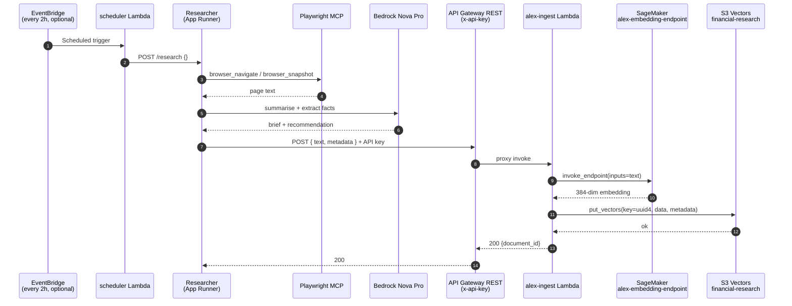
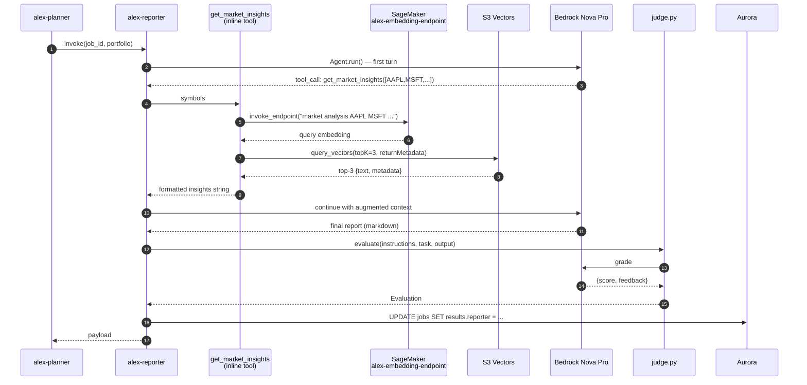
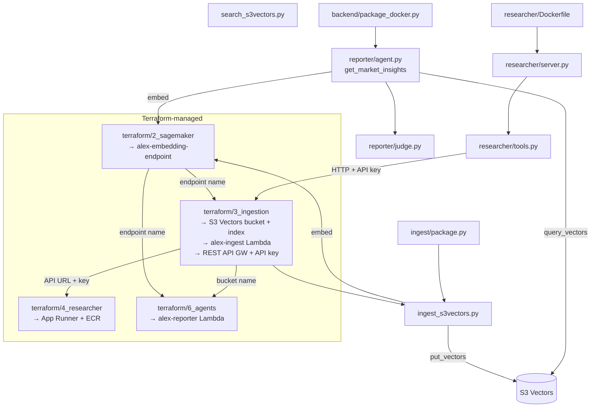

# RAG Pipeline

Retrieval-Augmented Generation in Alex has a **write path** (autonomous Researcher populates the knowledge base) and a **read path** (Reporter retrieves context at report-generation time). Both converge on the same vector store.

**Assumption:** Researcher is the *only* default producer; any external caller with the API key can also ingest through the same REST endpoint.

---

## Moving Parts

| Role | Component | Code |
|---|---|---|
| Embedding model | SageMaker Serverless endpoint `alex-embedding-endpoint` (HuggingFace `sentence-transformers/all-MiniLM-L6-v2`, 384-dim) | provisioned by `terraform/2_sagemaker` |
| Vector store | S3 Vectors bucket `alex-vectors-{account_id}`, index `financial-research`, Cosine | provisioned by `terraform/3_ingestion` |
| Raw-doc archive | S3 standard bucket (dual-bucket pattern) | provisioned by `terraform/3_ingestion` |
| Ingest Lambda | `alex-ingest` behind API Gateway REST + API key | `backend/ingest/ingest_s3vectors.py` |
| Search Lambda (admin/test) | companion GET-style endpoint | `backend/ingest/search_s3vectors.py` |
| Producer agent | Researcher on App Runner | `backend/researcher/` |
| Consumer agent | Reporter Lambda | `backend/reporter/agent.py` (`get_market_insights` tool) |
| Packaging | `backend/ingest/package.py` (cross-platform, no Docker) | emits `lambda_function.zip` |
| Admin | `backend/ingest/cleanup_s3vectors.py`, `test_ingest_s3vectors.py`, `test_search_s3vectors.py` | local scripts |

---

## Code Files — What Each Does

### Write path (producer side)
- **`backend/researcher/server.py`** — FastAPI `/research` endpoint on App Runner. Spins up the agent loop.
- **`backend/researcher/context.py`** — 3-step instructions: *browse → analyse → save*.
- **`backend/researcher/mcp_servers.py`** — launches `@playwright/mcp` as an MCP subprocess (headless Chromium) so the agent can read web pages.
- **`backend/researcher/tools.py`** — `ingest_financial_document` function-tool. Wraps `httpx.post(ALEX_API_ENDPOINT, headers={"x-api-key": ALEX_API_KEY})` with `tenacity` retries.
- **`backend/ingest/ingest_s3vectors.py`** — the actual Lambda. Two calls: `sagemaker_runtime.invoke_endpoint` to embed, then `s3vectors.put_vectors` to upsert `{key=uuid4, data=float32[384], metadata={text, timestamp, ...}}`.
- **`backend/ingest/package.py`** — builds `lambda_function.zip` from `ingest_s3vectors.py` + `uv`-resolved deps; plain zip, no Docker needed (pure-boto Lambda).

### Read path (consumer side)
- **`backend/reporter/agent.py::get_market_insights`** — the RAG tool. Does retrieval **inline** (not via the search Lambda) to avoid an extra hop:
  1. Build query string `f"market analysis {' '.join(symbols[:5])}"`.
  2. `sagemaker_runtime.invoke_endpoint` → 384-dim embedding.
  3. `s3vectors.query_vectors(topK=3, returnMetadata=True)`.
  4. Concatenate the `metadata.text` fields (truncated to 200 chars each) into the string returned to the LLM.
- **`backend/reporter/templates.py`** — system prompt instructs the model to *always* call `get_market_insights` before drafting the report.
- **`backend/reporter/judge.py`** — LLM-as-judge grades drafts 0–100; implicitly penalises reports that ignore retrieved context.

### Admin / test
- **`backend/ingest/search_s3vectors.py`** — stand-alone search Lambda (useful for curl-based smoke tests and the Explorer UI; not on the Reporter's hot path).
- **`backend/ingest/test_ingest_s3vectors.py`** — end-to-end ingest test (HTTP → Lambda → SageMaker → S3 Vectors).
- **`backend/ingest/test_search_s3vectors.py`** — retrieval smoke test.
- **`backend/ingest/cleanup_s3vectors.py`** — direct-to-S3-Vectors purge (no API Gateway).

---

## Write Path (Ingestion) — Sequence



## Read Path (Retrieval + Generation) — Sequence



---

## Component Dependencies



---

## Build & Deploy to Production — Step by Step

Assumes Guide 1 IAM is complete and Bedrock Nova Pro access is granted in the right regions.

```mermaid
flowchart LR
    A["1 Deploy embeddings<br/>cd terraform/2_sagemaker<br/>terraform apply"] --> B["2 Note output:<br/>SAGEMAKER_ENDPOINT"]
    B --> C["3 Package ingest<br/>cd backend/ingest<br/>uv run package.py"]
    C --> D["4 Deploy vector store + ingest API<br/>cd terraform/3_ingestion<br/>terraform apply"]
    D --> E["5 Note outputs:<br/>VECTOR_BUCKET, INGEST_API_URL,<br/>INGEST_API_KEY"]
    E --> F["6 Build + push Researcher<br/>cd backend/researcher<br/>uv run deploy.py<br/>(docker build --platform linux/amd64,<br/>docker push ECR)"]
    F --> G["7 Deploy Researcher service<br/>cd terraform/4_researcher<br/>terraform apply<br/>(wires ALEX_API_ENDPOINT + API key env)"]
    G --> H["8 Optional: scheduler<br/>terraform/4_researcher<br/>enables EventBridge every 2h"]
    H --> I["9 Package Reporter<br/>cd backend/reporter<br/>uv run package_docker.py"]
    I --> J["10 Deploy agent orchestra<br/>cd terraform/6_agents<br/>terraform apply<br/>(wires VECTOR_BUCKET, SAGEMAKER_ENDPOINT<br/>env into alex-reporter)"]
    J --> K["11 Smoke test retrieval<br/>uv run ingest/test_ingest_s3vectors.py<br/>uv run ingest/test_search_s3vectors.py"]
    K --> L["12 End-to-end<br/>POST to /research → observe vectors grow<br/>trigger analysis job → verify reporter cites insights"]
```



### Concrete commands

```bash
# 1-2 Embeddings
cd terraform/2_sagemaker && terraform apply
terraform output sagemaker_endpoint_name   # copy to .env as SAGEMAKER_ENDPOINT

# 3-4 Ingest + vector store
cd ../../backend/ingest && uv run package.py
cd ../../terraform/3_ingestion && terraform apply
terraform output vector_bucket ingest_api_url ingest_api_key

# 5-7 Researcher
cd ../../backend/researcher && uv run deploy.py
cd ../../terraform/4_researcher && terraform apply

# 8 Reporter (and the rest of the orchestra)
cd ../../backend/reporter && uv run package_docker.py
cd ../.. && uv run backend/deploy_all_lambdas.py
cd terraform/6_agents && terraform apply

# 9 Smoke
cd ../../backend/ingest
uv run test_ingest_s3vectors.py
uv run test_search_s3vectors.py
```

---

## Environment Variables (RAG-relevant only)

| Variable | Read by | Source |
|---|---|---|
| `SAGEMAKER_ENDPOINT` | ingest Lambda, search Lambda, Reporter | output of `terraform/2_sagemaker` |
| `VECTOR_BUCKET` | ingest Lambda, search Lambda | output of `terraform/3_ingestion` |
| `INDEX_NAME` (defaults to `financial-research`) | ingest + search Lambdas, Reporter (hardcoded) | — |
| `ALEX_API_ENDPOINT` | Researcher | output of `terraform/3_ingestion` |
| `ALEX_API_KEY` | Researcher | output of `terraform/3_ingestion` |
| `DEFAULT_AWS_REGION` | Reporter (for SageMaker + S3 Vectors clients) | `.env` |
| `BEDROCK_MODEL_ID` / `BEDROCK_REGION` | Reporter, Researcher, Judge | `.env` |

---

## Notes / Gotchas

- **Reporter does retrieval inline**, not through the search Lambda — saves one hop and one API Gateway charge. The `search_s3vectors.py` Lambda exists for debugging / external tooling.
- **Account-scoped bucket name**: Reporter derives `alex-vectors-{account_id}` at runtime via `sts:GetCallerIdentity`, so the Lambda role needs `sts:GetCallerIdentity` and `s3vectors:QueryVectors` permissions.
- **Embedding dimension must match the index.** The index is created with 384 dims to match MiniLM-L6-v2 — changing the model requires reindexing.
- **Metadata schema is flexible**: `text`, `timestamp` are always present; Researcher adds `source`, `category`, `company_name`, etc.
- **Chunking is minimal** — whole research summaries are stored as one vector (they're short by design per `researcher/context.py`). No splitter is configured.
- **No re-ranker.** `topK=3` + `returnDistance` is the whole retrieval; ranking is raw Cosine distance from S3 Vectors.
- **API key is the only auth** on the ingest endpoint. Rotate it via `terraform taint` + `apply`.
- **Cold start**: SageMaker Serverless endpoint may add 1–3 s latency after idle; acceptable for report generation, noticeable in tight smoke tests.
