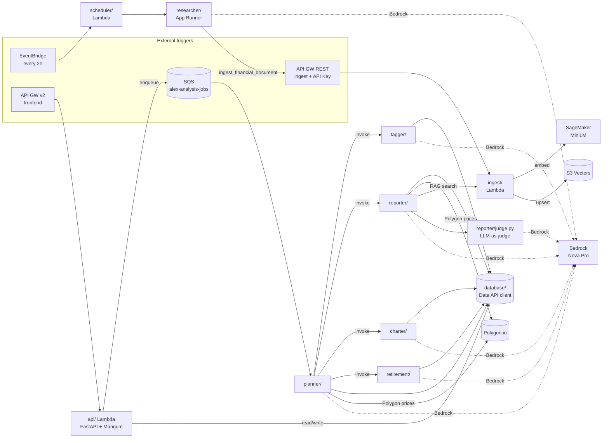
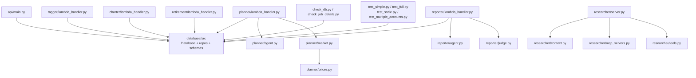
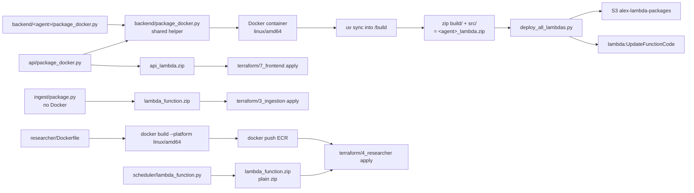

# Backend — Code Layout

All Python code for Alex's agents, APIs, ingestion, database library, and deployment tooling. Each subdirectory is its own `uv` project (independent `pyproject.toml` + `uv.lock`).

**Assumption:** all commands run via `uv` (e.g. `uv run test_simple.py`). Never `pip install`.

---

## Directory Map

```
backend/
├── api/            # FastAPI + Mangum Lambda (frontend-facing REST)
├── planner/        # Orchestrator agent (SQS-triggered)
├── tagger/         # Instrument classification agent
├── reporter/       # Narrative portfolio report agent (+ LLM-judge)
├── charter/        # Chart-spec agent (Recharts JSON)
├── retirement/     # Retirement projection agent
├── researcher/     # App Runner Docker agent (web + Playwright MCP)
├── scheduler/      # Tiny Lambda that pokes App Runner on EventBridge
├── ingest/         # S3 Vectors ingest + search Lambda code
├── database/       # Shared Aurora Data API library + migrations + seed
├── package_docker.py       # Shared Docker-based Lambda packager
├── deploy_all_lambdas.py   # Upload all agent zips + update Lambda configs
├── test_simple.py          # Local end-to-end test (mocks downstream Lambdas)
├── test_full.py            # Live end-to-end test against deployed Lambdas
├── test_scale.py           # Parallel-load test
├── test_multiple_accounts.py
├── watch_agents.py         # Tail CloudWatch logs of all 5 agents w/ colour
├── check_db.py             # Quick DB sanity check
├── check_job_details.py    # Inspect a single job row
└── pyproject.toml          # Root uv project (shared deps for top-level scripts)
```

---

## Shared Structure (every agent)

Each of `planner`, `tagger`, `reporter`, `charter`, `retirement` follows the same idiomatic OpenAI Agents SDK layout:

| File | Purpose |
|---|---|
| `lambda_handler.py` | Lambda entrypoint; loads config, pulls job row, calls agent, writes results back |
| `agent.py` | `create_agent()` factory — builds `LitellmModel` (Bedrock), `@function_tool`s, context dataclass, and the task prompt |
| `templates.py` | System/user prompt templates (INSTRUCTIONS constants) |
| `observability.py` | LangFuse + Logfire bootstrap; structured JSON logging helper |
| `package_docker.py` | Per-agent wrapper that calls the shared Docker packager to emit `<agent>_lambda.zip` |
| `test_simple.py` | Local invocation (often with `MOCK_LAMBDAS=true`) |
| `test_full.py` | Invokes the deployed Lambda via boto3 |
| `pyproject.toml` / `uv.lock` | Isolated dependency set |

---

## Agent Directories — What Each Does

### `planner/` — Orchestrator
- **Trigger:** SQS `alex-analysis-jobs` message (`job_id`).
- **Role:** reads job, fetches current prices, fan-outs to Tagger/Reporter/Charter/Retirement via `lambda:Invoke`, aggregates, writes final results to `jobs.results`.
- Extras: `market.py` updates instrument prices in bulk; `prices.py` wraps Polygon.io (`RESTClient`), handles market-open check, caches; `aurora_config.json` holds local dev DB config.
- Tools exposed to the agent: `invoke_tagger`, `invoke_reporter`, `invoke_charter`, `invoke_retirement` (mockable via `MOCK_LAMBDAS=true`).

### `tagger/` — Instrument Classifier
- Classifies unknown symbols (ETF / stock / sector / region, etc.) and upserts into `instruments` table.
- `track_tagger.py` and `try_tagger.py` — local dev harnesses for iterating on prompts.

### `reporter/` — Narrative Portfolio Report
- Produces the markdown report the UI renders.
- Tools: RAG query against S3 Vectors, Polygon prices, Aurora reads.
- `judge.py` — second-pass **LLM-as-judge** that scores the draft (0–100 + feedback) using a separate model config. Used for evaluation / guardrails.

### `charter/` — Chart Spec Generator
- Emits structured JSON (via Agents SDK structured outputs) that the frontend feeds straight to Recharts. No tools, just Bedrock + schema.

### `retirement/` — Retirement Projections
- Runs projection math (contribution, growth, drawdown) based on user preferences + current portfolio value. Returns structured output consumed by the frontend retirement chart.

### `researcher/` — Autonomous Web Researcher (App Runner, not Lambda)
- Long-running Docker container; not SQS-triggered.
- `server.py` — FastAPI with `POST /research` endpoint.
- `context.py` — instructions / persona / step-plan.
- `mcp_servers.py` — spins up `@playwright/mcp` as an `MCPServerStdio` subprocess for headless browsing.
- `tools.py` — `ingest_financial_document` tool: POSTs to the Ingest API with the API key (with `tenacity` retry).
- `Dockerfile` + `.dockerignore` — linux/amd64 image pushed to ECR.
- `deploy.py` — end-to-end build + `docker push` + `terraform`-aware App Runner deploy helper.
- `test_local.py` / `test_research.py` — local harness.

### `scheduler/` — EventBridge Glue Lambda
- `lambda_function.py` — 40-line `urllib` POST to `APP_RUNNER_URL/research`. Triggered by EventBridge every 2h (optional).

---

## Supporting Directories

### `api/` — Frontend-facing FastAPI on Lambda
- `main.py` — all REST routes; Clerk JWT auth via `fastapi_clerk_auth`; CORS from `CORS_ORIGINS` env; uses `database.src.Database`; enqueues jobs onto SQS.
- `lambda_handler.py` — `Mangum(app)` wrapper.
- `package_docker.py` — builds `api_lambda.zip` for linux/amd64.

### `ingest/` — S3 Vectors Lambda
- `ingest_s3vectors.py` — Lambda handler behind the REST API Gateway (`x-api-key`). Calls SageMaker endpoint to embed text, then `s3vectors.put_vectors` into the `financial-research` index.
- `search_s3vectors.py` — companion search handler.
- `cleanup_s3vectors.py` — local admin script to purge vectors.
- `package.py` — cross-platform zip packager (no Docker needed for this Lambda).
- `test_ingest_s3vectors.py` / `test_search_s3vectors.py` — live-API smoke tests.

### `database/` — Shared DB Library
- `src/client.py` — `DataAPIClient` wrapping `boto3 rds-data` (Aurora Data API — no DB driver, no VPC).
- `src/models.py` — repository classes (`UsersRepo`, `InstrumentsRepo`, `AccountsRepo`, `PositionsRepo`, `JobsRepo`) exposed via `Database()`.
- `src/schemas.py` — Pydantic schemas (`UserCreate`, `JobCreate`, `JobStatus`, `JobType`…).
- `migrations/001_schema.sql` — single migration: `users`, `instruments`, `accounts`, `positions`, `jobs`.
- `run_migrations.py` — apply migrations.
- `seed_data.py` — 22 ETF seed rows.
- `reset_db.py` — drop + re-run migrations + reseed.
- `verify_database.py` — health check.
- `test_data_api.py` — smoke test for Data API connectivity.

### Top-level scripts
- `package_docker.py` — **shared** packaging helper (agent `package_docker.py` files just call this). Runs a Docker container to `uv sync`, bundles site-packages + source into `<agent>_lambda.zip`, targets linux/amd64.
- `deploy_all_lambdas.py` — uploads each `<agent>_lambda.zip` to `alex-lambda-packages-{account_id}` S3 and calls `lambda:UpdateFunctionCode` for all five agents.
- `watch_agents.py` — colour-coded `logs tail` across all 5 agent log groups in parallel threads.
- `test_simple.py` / `test_full.py` / `test_scale.py` / `test_multiple_accounts.py` — end-to-end test harnesses at varying fidelity.
- `check_db.py` / `check_job_details.py` — quick DB inspection one-shots.
- `vectorize_me.json` — fixture payload for manual ingest testing.
- `output.json` — captured Lambda output from the last `invoke` (gitignored in practice).

---

## Runtime Dependency Graph (inside `backend/`)



---

## Shared Module Dependencies (in-repo imports)



Every agent directory additionally has `agent.py`, `templates.py`, and `observability.py` that the handler imports — omitted above for legibility.

---

## Build / Packaging Flow



---

## Testing Strategy

| Level | File | What it does |
|---|---|---|
| Unit-ish, per agent | `<agent>/test_simple.py` | Invoke handler locally; `MOCK_LAMBDAS=true` so downstream agents don't fire |
| Integration, per agent | `<agent>/test_full.py` | `lambda.invoke` against deployed Lambda; asserts status + shape |
| Full E2E | `backend/test_simple.py` | Enqueue job locally, run Planner in-process, mocks downstream |
| Full E2E live | `backend/test_full.py` | Enqueue SQS → Planner Lambda → all 5 agents → Aurora results |
| Load | `backend/test_scale.py` | Parallel jobs; surfaces throttling/timeouts |
| Multi-tenant | `backend/test_multiple_accounts.py` | Concurrent jobs across user contexts |

Rule of thumb: `test_simple` **before** packaging, `test_full` **after** `deploy_all_lambdas.py`.

---

## Key Env Vars (by process)

- **All agents:** `BEDROCK_MODEL_ID`, `BEDROCK_REGION` (→ sets `AWS_REGION_NAME` for LiteLLM), `AURORA_CLUSTER_ARN`, `AURORA_SECRET_ARN`, `DATABASE_NAME`, `OPENAI_API_KEY` (traces only), `LANGFUSE_*`, `LOGFIRE_TOKEN`.
- **Planner:** `TAGGER_FUNCTION`, `REPORTER_FUNCTION`, `CHARTER_FUNCTION`, `RETIREMENT_FUNCTION`, `MOCK_LAMBDAS`, `POLYGON_API_KEY`, `POLYGON_PLAN`.
- **Reporter:** vector search env (`VECTOR_BUCKET`, `INDEX_NAME`, `SAGEMAKER_ENDPOINT`) + Polygon.
- **API:** `CLERK_*`, `CORS_ORIGINS`, `SQS_QUEUE_URL`, Aurora ARNs.
- **Ingest:** `VECTOR_BUCKET`, `INDEX_NAME`, `SAGEMAKER_ENDPOINT`.
- **Researcher:** `ALEX_API_ENDPOINT`, `ALEX_API_KEY`, Bedrock config.
- **Scheduler:** `APP_RUNNER_URL`.

---

## Notes / Assumptions

- **`reporter/judge.py`** defaults to a Claude 3.7 Sonnet model ID in code; all *main* agents use Nova Pro. Judge model is independently configurable via its own env var.
- **`output.json`** and `__pycache__/` folders are artefacts from local runs, not source.
- **`*_lambda.zip`** files in each agent directory are build outputs (50–90 MB) and should be considered disposable — regenerate with `package_docker.py`.
- **Nested uv projects:** `uv` warns about nested projects; this is intentional and safe — each agent has its own isolated dep tree so Lambda zips stay slim.
