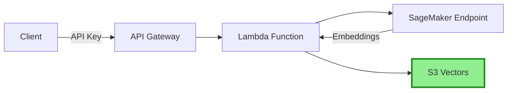

# Building Alex: Part 3 - Ingestion Pipeline with S3 Vectors

Welcome back! In this guide, we'll deploy a cost-effective vector storage solution using AWS S3 Vectors:
- S3 Vectors for vector storage (90% cheaper than OpenSearch!)
- Lambda function for document ingestion  
- API Gateway with API key authentication
- Integration with the SageMaker embedding endpoint

## Prerequisites
- Completed [Guide 1](1_permissions.md) (AWS setup)
- Completed [Guide 2](2_sagemaker.md) (SageMaker deployment)
- AWS CLI configured
- Terraform installed
- Python with `uv` package manager installed

## REMINDER - MAJOR TIP!!

There's a file `gameplan.md` in the project root that describes the entire Alex project to an AI Agent, so that you can ask questions and get help. There's also an identical `CLAUDE.md` and `AGENTS.md` file. If you need help, simply start your favorite AI Agent, and give it this instruction:

> I am a student on the course AI in Production. We are in the course repo. Read the file `gameplan.md` for a briefing on the project. Read this file completely and read all the linked guides carefully. Do not start any work apart from reading and checking directory structure. When you have completed all reading, let me know if you have questions before we get started.

After answering questions, say exactly which guide you're on and any issues. Be careful to validate every suggestion; always ask for the root cause and evidence of problems. LLMs have a tendency to jump to conclusions, but they often correct themselves when they need to provide evidence.

## About S3 Vectors

S3 Vectors is AWS's native vector storage solution, offering 90% cost savings compared to traditional vector databases. It uses a separate namespace (`s3vectors`) from regular S3.

## Step 1: Create S3 Vector Bucket

Since S3 Vectors uses a different namespace than regular S3, we'll create it via the AWS Console:

1. Go to the [S3 Console](https://console.aws.amazon.com/s3/)
2. Look for **"Vector buckets"** in the left navigation (not regular buckets)
3. Click **"Create vector bucket"**
4. Configure:
   - Bucket name: `alex-vectors-{your-account-id}` (replace with your actual account ID)
   - Encryption: Keep default (SSE-S3)
5. After creating the bucket, create an index:
   - Index name: `financial-research`
   - Dimension: `384`
   - Distance metric: `Cosine`
   - Encryption: Specify Encryption Type, Use bucket settings for encryption
6. Click **"Create vector index"**

**Note:** Have to do via Console, The Console is used only because Terraform doesn't yet have the "buttons" to create this specific type of high-performance storage index.

## Step 2: Prepare the Lambda Deployment Package

The Lambda function code is already in the repository:

```bash
# Navigate to the ingest directory
cd backend/ingest

# Install dependencies and create deployment package
uv run package.py
```

This creates `lambda_function.zip` containing your function and all dependencies. You should see:
```
✅ Deployment package created: lambda_function.zip
   Size: ~15 MB
```

### Under the hood:
The uv run package.py command is a "bundler" script that prepares your code for AWS Lambda. Here is the terse breakdown:

1. .venv (The Source)
When you run uv run, uv automatically creates this virtual environment and installs all dependencies listed in your pyproject.toml. It ensures your local environment has the exact libraries (like boto3 or requests) that the code needs to run.

2. package.py (The Builder)
The script performs four quick steps:

- Locates the libraries inside that .venv folder.
- Copies those libraries into a temporary workspace.
- Adds your actual Python logic files (ingest_s3vectors.py, etc.) to that same workspace.
- Zips everything together.

3. lambda_function.zip (The Result)
This is your Deployment Package. Since AWS Lambda doesn't have your local .venv, you must upload this single file containing both your code and all its dependencies.

In short: .venv is for local execution; lambda_function.zip is your code's "suitcase" for its trip to the AWS Cloud.


## Step 3: Configure and Deploy the Infrastructure

First, set up the Terraform variables:

```bash
# Navigate to the ingestion terraform directory
cd ../../terraform/3_ingestion

# Copy the example variables file
cp terraform.tfvars.example terraform.tfvars
```

Edit `terraform.tfvars` and set your values:
```hcl
aws_region = "us-east-1"  # Use your DEFAULT_AWS_REGION from .env
sagemaker_endpoint_name = "alex-embedding-endpoint"  # From Part 2
```

Now deploy the infrastructure:

```bash
# Initialize Terraform (creates local state file)
terraform init

# Deploy the infrastructure
terraform apply
```

Type `yes` when prompted. The deployment takes 2-3 minutes.

Note: The Lambda function expects the deployment package to exist at `../../backend/ingest/lambda_function.zip` (which you created in Step 2).


### Under the Hood: terraform apply (From Scratch)
Here is the terse breakdown of what Terraform actually built for your ingestion pipeline:

1. Storage (Standard S3 Bucket): Created alex-vectors-864981739490 with strict public access blocks, default encryption, and versioning enabled.
2. Security (IAM Roles): Created alex-ingest-lambda-role granting the upcoming Lambda permission to read/write to your S3 bucket, invoke SageMaker, and write to CloudWatch logs.
3. Compute (Lambda): Uploaded your lambda_function.zip and created the alex-ingest function, attaching the IAM role and setting environment variables (VECTOR_BUCKET & SAGEMAKER_ENDPOINT).
4. Logging (CloudWatch): Created the /aws/lambda/alex-ingest log group where Lambda run logs will be stored. (This was the step that initially failed due to permissions!).
5. API Layer (API Gateway):
- Created a REST API endpoint (/ingest).
- Wired it to trigger the Lambda function.
- Built a Usage Plan and generated an API Key (alex-api-key) to secure it against unauthorized requests.

## Reason for Dual S3 Architecture: Vector vs Standard S3

This course uses a "Hybrid Storage" approach. You now have two buckets with the same name, but in different namespaces:

*   **The Index (Vector S3 - "The Card Catalog"):** You created this in the Console. It stores mathematical embeddings (384 floating-point numbers) but *not* full files. It's optimized for similarity search (finding meaning).
*   **The Library (Standard S3 - "The Filing Cabinet"):** Terraform created this. It stores the full, original source documents (PDFs, CSVs, SEC filings) for permanent record.

### How they work together (Terse Breakdown)

1.  **The Trigger:** User sends a request (currently raw text, eventually PDFs) to the API Gateway.
2.  **The Processing:** Lambda coordinated everything—it gets the "AI math" (embeddings) from **SageMaker**.
3.  **The Data Handoff:** Lambda saves the original long-form file to the **Standard Bucket** (the "Filing Cabinet") first, then generates and uploads the mathematical vector to the **Vector Bucket** (the "Index").
4.  **Retrieval:** When you ask Alex a question, he searches the **Vector Bucket** to find exactly *where* to look, then pulls the high-quality source text from the **Standard Bucket**.

**Why two?** S3 Vectors is a specialized "search engine" for AI math. By splitting "Search" (Vectors) from "Storage" (Standard S3), we get 90% cost savings compared to traditional AI databases!

## Step 4: Save Your Configuration

After deployment, Terraform will display important outputs. You need to save these values to your `.env` file.


💡 **Tip**: You can view Terraform outputs anytime:
```bash
cd terraform/3_ingestion
terraform output
```
And retrieve the API Key ID, Vector Bucket Name and API endpoint from the output.

### Confirm the commands on Your API Key

Finally with the API Key ID, get your API key value using the command shown in Terraform output: This will be used for `ALEX_API_KEY` in your `.env` file.
```bash
# Replace the ID with the one from your Terraform output
aws apigateway get-api-key --api-key YOUR_API_KEY_ID --include-value --query 'value' --output text

# Real one:
aws apigateway get-api-key --api-key 9fvembr9ag --include-value --query 'value' --output text
# Example output: vHIXNXBlUG9rFohQJKBre4IXkJ6MXxAnasCQYmLm
```

### Update Your .env File

Navigate back to project root and update your `.env`:
```bash
cd ../..

nano .env  # or use your preferred editor
```

Add or update these lines in your `.env` file:
```
# From Part 3 - get these values from Terraform output
VECTOR_BUCKET=alex-vectors-YOUR_ACCOUNT_ID
ALEX_API_ENDPOINT=https://xxxxxxxxxx.execute-api.us-east-1.amazonaws.com/prod/ingest
ALEX_API_KEY=your-api-key-here
```

## Step 5: Test the Setup

Test document ingestion directly via S3 Vectors:

```bash
cd backend/ingest
uv run test_ingest_s3vectors.py
```

You should see:
```
✓ Success! Document ID: [uuid]
Testing complete!
```

### Under the Hood: test_ingest_s3vectors.py

1. **Initialization**: Imports `boto3` and your `vector_client` (which wraps the S3 Vectors API).
2. **Document Loading**: Reads the content of `TSLA.txt`, `AMZN.txt`, and `NVDA.txt`.
3. **Embedding**: Sends the text to your SageMaker endpoint (`alex-embedding-endpoint`) to get the mathematical vector.
4. **Storage**: Uses the  `s3vectors` Boto3 client to store the vector in the `alex-vectors-YOUR_ACCOUNT_ID` bucket, under the `financial-research` index.

What you will see in S3:
- Standard S3: Nothing from this script.
- Note: You should rely on search APIs (like running test_search_s3vectors.py) to verify the data rather than checking the S3 console manually.

## Step 6: Test Search

Now test that you can search the documents:

```bash
uv run test_search_s3vectors.py
```

You should see the three documents (Tesla, Amazon, NVIDIA) that were just ingested, and example semantic searches showing how S3 Vectors finds related content.

### Under the Hood: test_search_s3vectors.py

1. **Initialization**: Imports `boto3` and your `vector_client` (which wraps the S3 Vectors API).
2. **Document Loading**: Reads the content of `TSLA.txt`, `AMZN.txt`, and `NVDA.txt`.
3. **Embedding**: Sends the text to your SageMaker endpoint (`alex-embedding-endpoint`) to get the mathematical vector.
4. **Storage**: Uses the  `s3vectors` Boto3 client to store the vector in the `alex-vectors-YOUR_ACCOUNT_ID` bucket, under the `financial-research` index.

Expected output:
```
============================================================
Alex S3 Vectors Database Explorer
============================================================
Bucket: alex-vectors-864981739490
Index: financial-research

Listing vectors in bucket: alex-vectors-864981739490, index: financial-research
============================================================

Found 3 vectors in the index:

1. Vector ID: c758c50e-4d84-45f5-a446-d0e2b4c2d579
   Ticker: AMZN
   Company: Amazon.com Inc.
   Sector: Technology/Retail
   Text: Amazon.com Inc. (AMZN) is a multinational technology company focusing on e-commerce, cloud computing...

2. Vector ID: b46539bd-5dc4-4528-92de-6ed34fb48f9e
   Ticker: NVDA
   Company: NVIDIA Corporation
   Sector: Technology/Semiconductors
   Text: NVIDIA Corporation (NVDA) designs graphics processing units (GPUs) for gaming and professional marke...

3. Vector ID: dbf040d0-f6e2-45e9-b346-1d65007d9b44
   Ticker: TSLA
   Company: Tesla Inc.
   Sector: Automotive/Energy
   Text: Tesla Inc. (TSLA) is an electric vehicle and clean energy company. It designs, manufactures, and sel...

============================================================
Example Semantic Searches
============================================================

Searching for: 'electric vehicles and sustainable transportation'
----------------------------------------
Found 3 results:

Score: 0.744
Company: Tesla Inc. (TSLA)
Text: Tesla Inc. (TSLA) is an electric vehicle and clean energy company. It designs, manufactures, and sells electric vehicles, energy storage systems, and solar panels....      

Score: 0.565
Company: Amazon.com Inc. (AMZN)
Text: Amazon.com Inc. (AMZN) is a multinational technology company focusing on e-commerce, cloud computing (AWS), digital streaming, and artificial intelligence....

Score: 0.550
Company: NVIDIA Corporation (NVDA)
Text: NVIDIA Corporation (NVDA) designs graphics processing units (GPUs) for gaming and professional markets, as well as system on chip units for mobile computing and automotive....


Searching for: 'cloud computing and AWS services'
----------------------------------------
Found 3 results:

Score: 0.749
Company: Amazon.com Inc. (AMZN)
Text: Amazon.com Inc. (AMZN) is a multinational technology company focusing on e-commerce, cloud computing (AWS), digital streaming, and artificial intelligence....

Score: 0.568
Company: Tesla Inc. (TSLA)
Text: Tesla Inc. (TSLA) is an electric vehicle and clean energy company. It designs, manufactures, and sells electric vehicles, energy storage systems, and solar panels....      

Score: 0.560
Company: NVIDIA Corporation (NVDA)
Text: NVIDIA Corporation (NVDA) designs graphics processing units (GPUs) for gaming and professional markets, as well as system on chip units for mobile computing and automotive....


Searching for: 'artificial intelligence and GPU computing'
----------------------------------------
Found 3 results:

Score: 0.778
Company: NVIDIA Corporation (NVDA)
Text: NVIDIA Corporation (NVDA) designs graphics processing units (GPUs) for gaming and professional markets, as well as system on chip units for mobile computing and automotive....

Score: 0.562
Company: Amazon.com Inc. (AMZN)
Text: Amazon.com Inc. (AMZN) is a multinational technology company focusing on e-commerce, cloud computing (AWS), digital streaming, and artificial intelligence....

Score: 0.514
Company: Tesla Inc. (TSLA)
Text: Tesla Inc. (TSLA) is an electric vehicle and clean energy company. It designs, manufactures, and sells electric vehicles, energy storage systems, and solar panels....      


✨ S3 Vectors provides semantic search - notice how it finds
   conceptually related documents even with different wording!
```

### Optional: Test via API Gateway

You can also test the API Gateway endpoint directly:

```bash
# Get your API key from .env or Terraform output
$ set -a; source .env; set +a

curl -X POST $ALEX_API_ENDPOINT \
  -H "x-api-key: $ALEX_API_KEY" \
  -H "Content-Type: application/json" \
  -d '{"text": "Test document via API", "metadata": {"source": "api_test"}}'

# We can also do the same in powershell by loading the .env variables but it will be a different powershell command
```

You should see:
```json
{"message": "Document indexed successfully", "document_id": "..."}

# Actual output:
{"message": "Document indexed successfully", "document_id": "5e12c1f6-51f2-48a2-95fe-dc20d8c9919b"}
```

**Where the `document_id` is from:**  
This ID was generated on-the-fly by your **AWS Lambda function**. Unlike the previous scripts which ran locally on your PC, this `curl` command sent data to a live API in the cloud. The Lambda code generates a brand-new, unique UUID for every single request it receives to ensure no collisions in the database.

### Under the Hood (The "Chain"):  
1.  **Request:** `curl` sends your JSON to **API Gateway**.  
2.  **Auth:** API Gateway checks the `x-api-key`. If valid, it triggers your **Ingest Lambda**.  
3.  **Processing (Inside Lambda):**  
    *   Lambda calls your **SageMaker endpoint** to turn your "Test document" text into a numerical vector.  
    *   Lambda generates a new `document_id`.  
    *   Lambda calls the `s3vectors` service to store the result in your **S3 Vector Bucket**.  
4.  **Response:** Lambda returns the success message and the new ID back across the internet to your terminal.

### What is "inside" the document_id?
Absolutely nothing.

It is a UUID v4 (Universally Unique Identifier). It's essentially a random 128-bit number.

It contains no data: It doesn't contain your text, your name, or a timestamp.
Purpose: It is simply a "license plate." Its only job is to be so random that it's impossible for two documents to ever accidentally get the same ID. It serves as the Key to look up your vector later.

### Why is document_id from Lambda different from document_id from test_search_s3vectors.py?

Both IDs are stored in the same S3 Vector bucket now. They differ because they were generated by two separate pieces of code at two different times. If you run the search script again, you should eventually see all of them (local ones + API ones) in the same list.


## Architecture Overview



## Cost Comparison

| Service | Monthly Cost (Estimate) |
|---------|------------------------|
| OpenSearch Serverless | ~$200-300 |
| S3 Vectors | ~$20-30 |
| **Savings** | **90%!** |

## Troubleshooting

### "Vector bucket not found"
- Ensure you created the bucket with vector configuration enabled
- Check the bucket name matches exactly

### "AccessDenied" errors
- Make sure your IAM user has S3 and S3 Vectors permissions
- The Lambda role needs `s3vectors:*` permissions

### S3 Vectors Command Not Found
- Ensure you have the latest AWS CLI version
- The `s3vectors` commands use a separate namespace from regular S3

### Lambda Handler Errors (500 Internal Server Error)
- Check CloudWatch logs: `aws logs tail /aws/lambda/alex-ingest`
- Verify environment variables are set correctly (SAGEMAKER_ENDPOINT, VECTOR_BUCKET)
- Ensure Lambda IAM role has `s3vectors:PutVectors` permission
- Lambda handler must be `ingest_s3vectors.lambda_handler`

## What's Next?

Congratulations! You now have a cost-effective vector storage solution. The infrastructure includes:
- ✅ S3 bucket with vector capabilities
- ✅ Lambda function for ingesting documents with embeddings
- ✅ API Gateway with secure API key authentication
- ✅ 90% cost savings compared to OpenSearch!

**Important**: Save the Terraform outputs - you'll need them for the next guide.

In [Guide 4](4_researcher.md), we'll deploy the Alex Researcher Agent that uses this infrastructure to provide intelligent investment insights.

## Clean Up (Optional)

If you want to destroy the infrastructure to avoid costs:

```bash
# From the terraform directory
terraform destroy
```

**Note**: This will destroy ALL resources including your SageMaker endpoint. Only do this if you're completely done with the project.