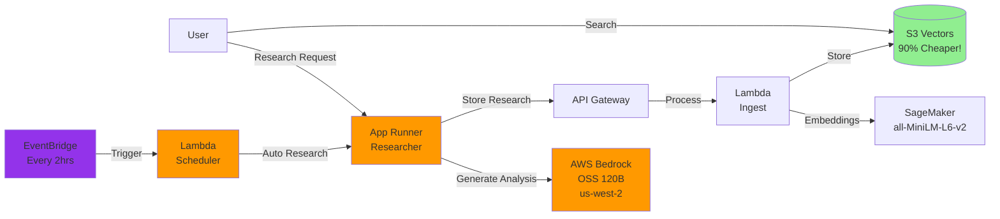
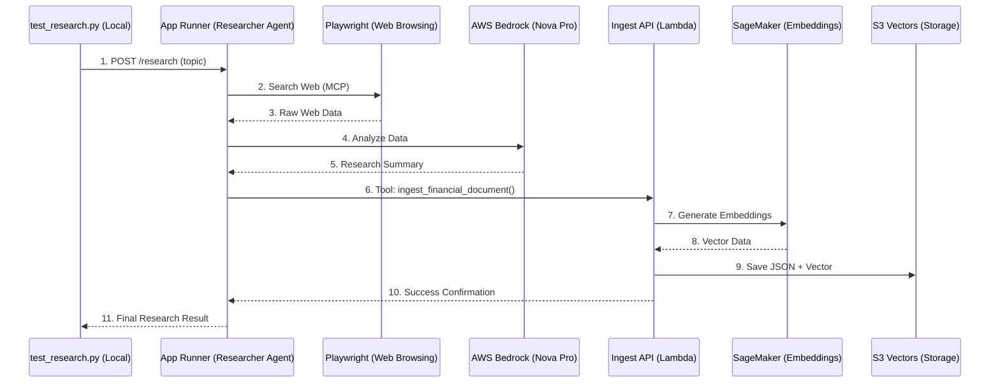
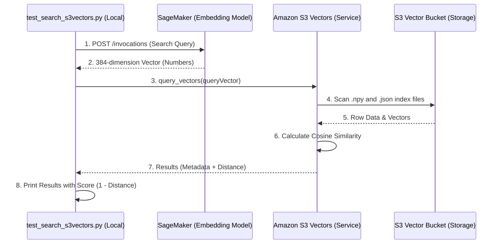

# Guide 4: Deploy the Researcher Agent

In this guide, you'll deploy the Alex Researcher service - an AI agent that generates investment research and automatically stores it in your knowledge base.

## Prerequisites

Before starting, ensure you have:
1. Completed Guides 1-3 (SageMaker, S3 Vectors, and Ingest Pipeline deployed)
2. Docker Desktop installed and running
3. AWS CLI configured with your credentials
4. Access to AWS Bedrock OpenAI OSS models (see Step 0 below)

## REMINDER - MAJOR TIP!!

There's a file `gameplan.md` in the project root that describes the entire Alex project to an AI Agent, so that you can ask questions and get help. There's also an identical `CLAUDE.md` and `AGENTS.md` file. If you need help, simply start your favorite AI Agent, and give it this instruction:

> I am a student on the course AI in Production. We are in the course repo. Read the file `gameplan.md` for a briefing on the project. Read this file completely and read all the linked guides carefully. Do not start any work apart from reading and checking directory structure. When you have completed all reading, let me know if you have questions before we get started.

After answering questions, say exactly which guide you're on and any issues. Be careful to validate every suggestion; always ask for the root cause and evidence of problems. LLMs have a tendency to jump to conclusions, but they often correct themselves when they need to provide evidence.

## What You'll Deploy

The Researcher service is an AWS App Runner application that:
- Uses the OpenAI Agents SDK for agent orchestration and tracing
- Uses AWS Bedrock with OpenAI's OSS 120B model for AI capabilities
- Employs a Playwright MCP (Model Context Protocol) server for web browsing and data retrieval
- Automatically calls your ingest pipeline to store research in S3 Vectors
- Provides a REST API for generating financial analysis on demand

Here's how it fits into the Alex architecture:



## Step 0: Request Access to Bedrock Models

The Researcher uses AWS Bedrock with OpenAI's open-source OSS 120B model. You need to request access to this model first.

### Request Model Access - these instructions are for OSS models, but you can also use Nova in us-east-1 or in your region (cheaper and easier)

1. Sign in to the AWS Console
2. Navigate to **Amazon Bedrock** service
3. Switch to the **US West (Oregon) us-west-2** region (top right corner)
4. In the left sidebar, click **Model access**
5. Click **Manage model access** or **Modify model access**
6. Find the **OpenAI** section
7. Check the boxes for:
   - **gpt-oss-120b** (OpenAI GPT OSS 120B)
   - **gpt-oss-20b** (OpenAI GPT OSS 20B) - optional, smaller model
8. Click **Request model access** at the bottom
9. Wait for approval (usually instant for these models)
10. As an alternative - request access to the Amazon Nova models in your region or in us-east-1

**Important Notes:**
- ⚠️ The OSS models are ONLY available in **us-west-2** region
- ✅ Your App Runner service can be in any region (e.g., us-east-1) and will connect cross-region to us-west-2
- The OSS models are open-weight models from OpenAI, not the commercial GPT models
- No API key is required for Bedrock - AWS IAM handles authentication
- The researcher requires an OpenAI API key for the OpenAI Agents SDK's tracing functionality (to monitor and debug agent execution)

## Extra part of Step 0: IMPORTANT - ADDED SINCE THE VIDEOS!!

### Update server.py with your model

With many thanks to Student Marcin B. for this crucial extra step.

In future labs, we will make this more configurable. But for this step, the Researcher Agent has some variables hard-coded which you will need to change.

Please look at the file `backend/researcher/server.py`

You should see this section:

```python
    # Please override these variables with the region you are using
    # Other choices: us-west-2 (for OpenAI OSS models) and eu-central-1
    REGION = "us-east-1"
    os.environ["AWS_REGION_NAME"] = REGION  # LiteLLM's preferred variable
    os.environ["AWS_REGION"] = REGION  # Boto3 standard
    os.environ["AWS_DEFAULT_REGION"] = REGION  # Fallback

    # Please override this variable with the model you are using
    # Common choices: bedrock/eu.amazon.nova-pro-v1:0 for EU and bedrock/us.amazon.nova-pro-v1:0 for US
    # or bedrock/amazon.nova-pro-v1:0 if you are not using inference profiles
    # bedrock/openai.gpt-oss-120b-1:0 for OpenAI OSS models
    # bedrock/converse/us.anthropic.claude-sonnet-4-20250514-v1:0 for Claude Sonnet 4
    # NOTE that nova-pro is needed to support tools and MCP servers; nova-lite is not enough - thank you Yuelin L.!
    MODEL = "bedrock/us.amazon.nova-pro-v1:0"
    model = LitellmModel(model=MODEL)
```

Please update the value of REGION and MODEL to reflect the model you have access to. See the examples given for possible values.  
Note that nova-lite is not an acceptable choice as it doesn't support tool calling / MCP. Thank you Yuelin L!

| Model | Type | Primary Use Case |
| :--- | :--- | :--- |
| **Nova Premier** | Multimodal | Advanced reasoning and complex problem-solving. |
| **Nova Pro** | Multimodal | Balanced performance for enterprise agents (recommended for Alex). |
| **Nova Lite** | Multimodal | High-speed, cost-effective processing of text/images/video. |
| **Nova Micro** | Text-only | Minimum latency and cost for pure text tasks. **This is the one we are using in the Digital Twin** |
| **Nova Canvas** | Image | High-quality image generation and editing. |
| **Nova Reel** | Video | High-definition video generation from text or images. |
| **Nova Sonic** | Speech | Real-time, low-latency speech-to-speech interactions. |

> [!TIP]
> **Nova Pro** is the flagship model used in this project for its optimal balance of speed and reasoning capabilities.

## Step 1: Deploy the Infrastructure

First, ensure you have your OpenAI API key and the values from Part 3 in your `.env` file.

Open the `.env` file in your project root using Cursor's file explorer and verify you have these values:
- `OPENAI_API_KEY` - Your OpenAI API key (required for agent tracing)
- `ALEX_API_ENDPOINT` - From Part 3
- `ALEX_API_KEY` - From Part 3

If you haven't added your OpenAI API key yet, add this line to the `.env` file:
```
OPENAI_API_KEY=sk-...  # Your actual OpenAI API key (required for agent tracing)
```

Now set up the initial infrastructure:

```bash
# Navigate to the terraform/4_researcher directory
# Copy the example variables file
cp terraform.tfvars.example terraform.tfvars
```

Edit `terraform.tfvars` and update with your values from the `.env` file:
```hcl
aws_region = "us-east-1"  # Your AWS region
openai_api_key = "sk-..."  # Your OpenAI API key
alex_api_endpoint = "https://xxxxxxxxxx.execute-api.us-east-1.amazonaws.com/prod/ingest"  # From Part 3
alex_api_key = "your-api-key-here"  # From Part 3
scheduler_enabled = false  # Keep false for now
```

Deploy the ECR repository and IAM roles first.

Mac/Linux:

```bash
# Initialize Terraform (creates local state file)
terraform init

# Deploy only the ECR repository and IAM roles (not App Runner yet)
terraform apply -target=aws_ecr_repository.researcher -target=aws_iam_role.app_runner_role
```

PC:

```powershell
# Initialize Terraform (creates local state file)
terraform init

# Deploy only the ECR repository and IAM roles (not App Runner yet)
terraform apply -target="aws_ecr_repository.researcher" -target="aws_iam_role.app_runner_role"
```


Type `yes` when prompted. This creates:
- ECR repository for your Docker images
- IAM roles with proper permissions for App Runner

Save the ECR repository URL shown in the output - you'll need it in Step 2.
```
# Real ECR repository URL
864981739490.dkr.ecr.us-east-1.amazonaws.com/alex-researcher
```

### Under the hood of terraform apply:
Created only the Elastic Container Registry (ECR) to hold your Docker image, and the IAM role. It outputted your new ECR repository string.

**Why selectively target these resources?** If you ran a full terraform apply, Terraform would attempt to create the AWS App Runner service alongside the ECR repository. This would fail because App Runner cannot start without a Docker image inside the repository.

Hence,

**Step 1:** By targeting just the ECR repository first, you create a place to push your Docker image to in Step 2. 

**Step 2:** Build and push the researcher Docker image to ECR.

**Step 3**: You'll run terraform apply on the rest of the infrastructure to finally create the App Runner service.

## Step 2: Build and Deploy the Researcher

Now we'll build the Docker container and deploy it to App Runner.

```bash
# Navigate to the backend/researcher directory
uv run deploy.py
```

This script will:
1. Build a Docker image (with `--platform linux/amd64` for compatibility)
2. Push it to your ECR repository
3. Trigger an App Runner deployment
4. Wait for the deployment to complete (3-5 minutes)
5. Display your service URL when ready

**Important Note for Apple Silicon Mac Users:**
The deployment script automatically builds for `linux/amd64` architecture to ensure compatibility with AWS App Runner. This is why you'll see "Building Docker image for linux/amd64..." in the output.

When the Docker image push completes, you'll see:
```
✅ Docker image pushed successfully!
```

### How deploy.py gets the ECR URL: 

It dynamically moves into your `terraform/4_researcher` directory and runs terraform output -raw ecr_repository_url to read the value straight from your deployed Terraform state.

### What happens under the hood during uv run deploy.py:

1. Retrieves your AWS Account ID, Region, and the ECR URL from Terraform.

2. Authenticates your local Docker engine to AWS ECR.

3. Builds a fresh Docker image of the researcher agent.

4. Tags the image and pushes it to your ECR repository.

5. Automatically connects to AWS App Runner and commands it to pull the latest image and deploy the new version (if the service is already running).

### Why linux/amd64 must be specified: 

AWS App Runner instances run strictly on Linux x86-64 (linux/amd64) architecture. Explicitly specifying the platform ensures that no matter what machine you run the script on (like a Mac with Apple Silicon/ARM), the built container will be 100% compatible with AWS.

Specifically, Docker builds your image for Linux (linux/amd64) inside your Windows machine. This ensures it works on AWS App Runner regardless of your PC's OS. This makes us not need to use WSL, as the combination of uv and Docker solves the "Linux compatibility" problem for you on PC.

#### The Problem: Windows vs. Linux

- System Libraries: They use different binary formats and core libraries (e.g., Windows `.dll` vs Linux `.so`).
- File Paths: Different conventions (`\` vs `/`).

#### How uv Resolves This:

- Dependency Locking: uv.lock ensures every machine installs the exact same version of every Python package.
- Environment Isolation: It creates a stable, isolated virtual environment that behaves the same way regardless of the host OS.

### Why Docker (App Runner) for Researcher, but Lambda for Planner/Reporter:

- Researcher Agent: Uses the Playwright MCP server to scrape the web, which requires heavy system-level dependencies (Node.js, Chromium, and various Linux GUI libraries). While not possible with Lambda, App Runner and Docker natively support this, and App Runner allows for longer timeouts than Lambda's 15-minute cap (deep research takes time).

- Other agents: Are simple, lightweight API integrations that natively fit into standard AWS Lambda .zip files, which keeps architecture simple and costs lower.

Here is a summary of the **Alex** project agents and their deployment methods:

| Agent | Role | Deployment Method |
| :--- | :--- | :--- |
| **Planner** | Task Orchestrator | AWS Lambda |
| **Tagger** | Instrument Classifier | AWS Lambda |
| **Reporter** | Portfolio Analysis | AWS Lambda |
| **Charter** | Data Visualization | AWS Lambda |
| **Retirement** | Retirement Projections | AWS Lambda |
| **Researcher** | Market Web Research | **AWS App Runner (Docker)** |

**Key Distinction:** The Researcher is the only agent using a Docker container on App Runner because it requires a full Linux environment with a browser (Playwright) to scrape the web, which exceeds Lambda's capabilities.

## Step 3: Create the App Runner Service

Now that your Docker image is in ECR, create the App Runner service:

```bash
# Navigate back to the terraform/4_researcher directory
# Deploy the complete infrastructure including App Runner
terraform apply
```

Type `yes` when prompted. This will:
- Create the App Runner service using your Docker image
- Configure environment variables for the service
- Set up the optional EventBridge scheduler (if enabled)

The App Runner service creation takes 3-5 minutes. When complete, you'll see the service URL in the output.

### Under the hood:

Terraform apply performs these 4 key actions for the Researcher:

1. IAM Roles & Policies: Creates two roles—one for App Runner to pull your image from ECR, and an "Instance Role" so your code has permission to call AWS Bedrock and SageMaker.

2. Infrastructure Provisioning: Spins up the App Runner Service, which is a managed server that automatically handles load balancing, health checks, and scaling.

3. Container Deployment: Pulls the specific Docker image you just built, starts the container, and maps internal port 8000 to the public URL.

4. Environment Injection: Securely passes your sensitive .env variables (like OPENAI_API_KEY and your Ingest API endpoint) directly into the running container.

### Outputs:

```
Outputs:

app_runner_service_id = "arn:aws:apprunner:us-east-1:864981739490:service/alex-researcher/bd5662fb0e2b4b709f27ce0d1652661f"
app_runner_service_url = "https://ckzei6inwm.us-east-1.awsapprunner.com"
ecr_repository_url = "864981739490.dkr.ecr.us-east-1.amazonaws.com/alex-researcher" 
scheduler_status = "Disabled"
setup_instructions = <<EOT

✅ Researcher service deployed successfully!

Service URL: https://ckzei6inwm.us-east-1.awsapprunner.com

Test the researcher:
curl https://ckzei6inwm.us-east-1.awsapprunner.com/research

💡 To enable automated research, set scheduler_enabled = true

Note: You'll need to deploy your actual researcher code to App Runner.
Follow the guide for instructions on building and deploying the Docker image. 
```

## Step 4: Test the Complete System

Now let's test the full pipeline: Research → Ingest → Search.

### 4.1: First, Clean the Database

Clear any existing test data:

```bash
# Navigate to the backend/ingest directory
uv run cleanup_s3vectors.py
```

You should see: "✅ All documents deleted successfully"

### Why clean up?
In later guides, you will need a clean vector store for:

1. RAG Accuracy (Guide 6): Testing the Reporter agent to ensure its portfolio analysis is grounded only in relevant, fresh data without "hallucinations" caused by unrelated old documents.

2. Citation Testing (Guide 6): Verifying the Planner agent correctly identifies and cites the exact source of information for a specific stock.

3. Guardrails/Observability (Guide 8): Testing how the system handles cases where no data exists. If you don't clean up, the agent might find "zombie" data from weeks ago instead of correctly reporting that it needs to perform new research.

4. End-to-End User Flow (Guide 7): Testing the "New User" experience where the portfolio starts empty and is built up from scratch.

### 4.2: Generate Research

Now let's generate some investment research:

```bash
# Navigate to the backend/researcher directory
uv run test_research.py
```

This script will:
1. Find your App Runner service URL automatically
2. Check that the service is healthy
3. Generate research on a trending topic (default)
4. Display the results
5. Automatically store it in your knowledge base

You can also research specific topics:
```bash
uv run test_research.py "Tesla competitive advantages"
uv run test_research.py "Microsoft cloud revenue growth"
```

The research takes 20-30 seconds as the agent browses financial websites and generates investment insights.

### Under the Hood:

#### Phase 1: Local Trigger (test_research.py)

1. URL Discovery: The script uses boto3 to find your App Runner service URL (lines 14–40).

2. Trigger Request: It sends an HTTP POST request to https://[your-url]/research with the topic "Agent's choice" (lines 85–89).

#### Phase 2: Orchestration on App Runner (server.py)

3. Entry Point: The FastAPI server receives the request at the @app.post("/research") endpoint (line 86).

4. Agent Initialization: It calls run_research_agent(), which initializes the OpenAI Agents SDK and sets the model to bedrock/us.amazon.nova-pro-v1:0 (line 57).

5. Browser Connection: It starts a Playwright MCP Server session inside the container (line 62).

#### Phase 3: The Reasoning Loop (agent.py)

6. Tool Selection: The Agent looks at its instructions. It realizes it needs data and calls the Playwright search tool (via MCP) to browse for trending financial topics.

7. Analysis: The Agent sends the scraped search results to AWS Bedrock (Nova Pro). Nova Pro processes the raw text, identifies key risks/opportunities, and writes a professional summary.

8. Action: The Agent decides the research is complete and invokes the ingest_financial_document tool (line 67 of server.py).

#### Phase 4: Data Ingestion Pipeline (tools.py → Ingest Lambda)

9. API Call: The ingest_financial_document function (in tools.py) takes the summary text and sends an HTTP POST to your Ingest API Endpoint (lines 19–24).

10. Vectorization: Your Ingest Lambda (from Guide 3) receives the text, sends it to SageMaker to generate embeddings, and saves the final package (.json) into S3 Vectors.

#### Phase 5: Result Delivery

11. Final Output: The Agent returns a success message to server.py, which returns it to your terminal as the RESEARCH RESULT.

### 4.3: Verify Data Storage

Check that the research was stored:

```bash
# Navigate to the backend/ingest directory
uv run test_search_s3vectors.py
```

You should see your research in the database with:
- The research content
- Embeddings generated by SageMaker
- Metadata including timestamp and topic

Search Cases:
- Documents Embedded: Only 1 (the "Tariffs" research document).

- Search Cases: The script automatically fed in 3 test queries ("electric vehicles", "cloud computing", and "AI") to demonstrate that semantic search will return the "Tariffs" document even if the words don't match, simply because it is the only document currently in the collection.

- Summary: The 3 searches were just "probes," but they all pointed to the same single document you generated.

### Under the Hood (S3 Vectors):

1. Retrieval: The script scans your S3 bucket (alex-vectors-...) for the latest .json files inside the financial-research/ folder.

2. Semantic Search: It takes your search query (e.g., "artificial intelligence"), sends it to your SageMaker endpoint to get a "query vector," and then calculates the Cosine Similarity (the mathematical distance) between that query vector and the document vectors stored in S3.

3. Local vs. Server-side: Unlike dedicated vector DBs (Pinecone/OpenSearch), S3 Vectors is cost-optimized. It performs the heavy math in the script (or a Lambda) while using S3 as extremely cheap storage for the vector data.

**How to Verify the Results:**

Semantic Test: Run uv run test_search_s3vectors.py "global trade policy". It should return the Tariffs document with a high score (e.g., > 0.7) because the meaning matches, even if the exact words "global trade" aren't in the text.

### 4.4: Test Semantic Search

Now test that semantic search works:

```bash
uv run test_search_s3vectors.py "electric vehicle market"
```

Expected result:

```
============================================================
Alex S3 Vectors Database Explorer
============================================================
Bucket: alex-vectors-864981739490
Index: financial-research

Listing vectors in bucket: alex-vectors-864981739490, index: financial-research     
============================================================

Found 1 vectors in the index:

1. Vector ID: fd27abe5-7ce2-4fe0-af52-ea6bfa3be0ef
   Text: Tariffs are a trending topic in finance, with recent news focusing on tariff refunds and the potenti...

============================================================
Example Semantic Searches
============================================================

Searching for: 'electric vehicles and sustainable transportation'
----------------------------------------
Found 1 results:

Score: 0.684
Text: Tariffs are a trending topic in finance, with recent news focusing on tariff refunds and the potential restoration of Trump-era tariffs. Key points include: 1. The US is launching a tariff refund port...


Searching for: 'cloud computing and AWS services'
----------------------------------------
Found 1 results:

Score: 0.648
Text: Tariffs are a trending topic in finance, with recent news focusing on tariff refunds and the potential restoration of Trump-era tariffs. Key points include: 1. The US is launching a tariff refund port...


Searching for: 'artificial intelligence and GPU computing'
----------------------------------------
Found 1 results:

Score: 0.638
Text: Tariffs are a trending topic in finance, with recent news focusing on tariff refunds and the potential restoration of Trump-era tariffs. Key points include: 1. The US is launching a tariff refund port...


✨ S3 Vectors provides semantic search - notice how it finds
   conceptually related documents even with different wording!
```

Even if you search for something different than what was stored, semantic search will find related content.

### Difference between 4.3 and 4.4:

No difference. Both commands trigger the exact same code execution because the script does not check for command-line arguments.

The guide breaks them into two steps (4.3 and 4.4) simply so you focus on the two different behaviors (storing vs. searching) contained within that single output.

## Step 5: Test the Researcher (Creates Data for Semantic Search)

Now that your service is deployed and tested, let's explore its capabilities.

### Test Health Check

Verify the service is healthy:

**Mac/Linux:**
```bash
curl https://YOUR_SERVICE_URL/health
```

**Windows PowerShell:**
```powershell
Invoke-WebRequest -Uri "https://YOUR_SERVICE_URL/health" | ConvertFrom-Json

# For example
Invoke-WebRequest -Uri "https://ckzei6inwm.us-east-1.awsapprunner.com/health" | ConvertFrom-Json
```

You should see:
```json
{
  "service": "Alex Researcher",
  "status": "healthy",
  "alex_api_configured": true,
  "timestamp": "2025-..."
}

# For Example:
service             : Alex Researcher
status              : healthy
alex_api_configured : True
timestamp           : 2026-04-19T01:43:03.378864+00:00
debug_container     : @{dockerenv=False; containerenv=False;
                      aws_execution_env=AWS_ECS_FARGATE; ecs_container_metadata=htt 
                      p://169.254.170.2/v3/8eed519b70eb43f68b1cb923c951dfd7-0193386 
                      898; kubernetes_service=}
aws_region          : us-east-1
bedrock_model       : bedrock/amazon.nova-pro-v1:0
```
#### Under the hood:
1. DNS Lookup: PowerShell resolves your App Runner domain name to an AWS IP address.

2. HTTPS Handshake: Your PC establishes a secure TLS connection with the AWS App Runner managed load balancer.

3. GET Request: PowerShell sends a standard HTTP GET request targeted at the /health endpoint.

4. Routing: AWS routes that request to your specific Docker container running your Python code.

5. FastAPI Invocation: In server.py, the @app.get("/health") function is triggered.

6. Backend Logic: The Python code generates a dictionary containing a timestamp, your AWS region, and container metadata (Line 130 in server.py).

7. Response: FastAPI serializes that dictionary into a JSON string and sends it back to your PC via the load balancer.


### Try Different Topics

1. **Generate Multiple Analyses:**
   ```bash
   # Navigate to the backend/research directory
   uv run test_research.py "NVIDIA AI chip market share"
   uv run test_research.py "Apple services revenue growth"
   uv run test_research.py "Gold vs Bitcoin as inflation hedge"
   ```

2. **Search Across Topics:**
   ```bash
   # Navigate to the backend/ingest directory
   uv run test_search_s3vectors.py "artificial intelligence"
   uv run test_search_s3vectors.py "inflation protection"
   ```

3. **Build Your Knowledge Base:**
   Try different investment topics and build a comprehensive knowledge base for portfolio management.

### Output for Test Research (Creating of Data)
```
# 1: uv run test_research.py "NVIDIA AI chip market share"
Getting App Runner service URL...
✅ Found service at: https://ckzei6inwm.us-east-1.awsapprunner.com

Checking service health...
✅ Service is healthy

🔬 Generating research for: NVIDIA AI chip market share
   This will take 20-30 seconds as the agent researches and analyzes...

✅ Research generated successfully!

============================================================
RESEARCH RESULT:
============================================================
The analysis on NVIDIA's AI chip market share has been successfully ingested into the database. Here's the summary:

- Market share: NVIDIA dominates the AI chip market.
- Revenue growth: Strong revenue growth driven by AI chip sales.
- Competitor comparison: NVIDIA's market share is much higher than its closest competitors.
- Future outlook: Positive outlook for continued growth in the AI chip market.      

Recommendation: Consider investing in NVIDIA due to its strong market position and growth potential in the AI chip market.
============================================================

✅ The research has been automatically stored in your knowledge base.
   To verify, run:
     cd ../ingest
     uv run test_search_s3vectors.py


# 2: uv run test_research.py "Apple services revenue growth"
Getting App Runner service URL...
✅ Found service at: https://ckzei6inwm.us-east-1.awsapprunner.com

Checking service health...
✅ Service is healthy

🔬 Generating research for: Apple services revenue growth
   This will take 20-30 seconds as the agent researches and analyzes...

✅ Research generated successfully!

============================================================
RESEARCH RESULT:
============================================================
The analysis has been successfully saved to the database. Here's a summary of the key points:

- Apple's services revenue for the last fiscal year (ending September 30, 2025) was $81.5 billion.
- This represents a 10.8% increase from the previous fiscal year (ending September 30, 2024), where services revenue was $73.5 billion.
- Services revenue growth has been a significant contributor to Apple's overall revenue growth.
- Recommendation: Consider Apple's services segment as a strong growth driver for future performance.
============================================================

✅ The research has been automatically stored in your knowledge base.
   To verify, run:
     cd ../ingest
     uv run test_search_s3vectors.py


# 3: uv run test_research.py "Gold vs Bitcoin as inflation hedge"
Getting App Runner service URL...
✅ Found service at: https://ckzei6inwm.us-east-1.awsapprunner.com

Checking service health...
✅ Service is healthy

🔬 Generating research for: Gold vs Bitcoin as inflation hedge
   This will take 20-30 seconds as the agent researches and analyzes...

✅ Research generated successfully!

============================================================
RESEARCH RESULT:
============================================================
Gold is currently a more reliable hedge against inflation compared to Bitcoin, based on the latest data. Gold showed a 1.48% increase, while Bitcoin experienced a 2.05% decrease. It is recommended to consider Gold for inflation hedging due to its relative stability.
============================================================

✅ The research has been automatically stored in your knowledge base.
   To verify, run:
     cd ../ingest
     uv run test_search_s3vectors.py
```

#### Under the hood:
1. URL Discovery: The local script calls aws apprunner describe-service to find your live service endpoint.

2. CLI Request: It sends an HTTP POST request to your App Runner /research endpoint with the payload {"topic": "topic"}.

3. Agent Activation: App Runner triggers the `run_research_agent` function in `server.py`.

4. Web Scraping: The Agent starts a Playwright MCP Server and uses a headless Chromium browser to search the live web for your topic.

5. AI Analysis: The raw webpage data is sent to AWS Bedrock (Nova Pro), which summarizes the findings into a financial report.

6. Tool Invocation: The Agent calls the `ingest_financial_document` (line 38) tool within its code in `backend/researcher/tools.py`.

7. Ingest API Hand-off: That tool sends an HTTP POST (with your API Key) to your Ingest API Gateway (from Guide 3).

8. Vectorization: The Ingest Lambda receives the report and calls your SageMaker endpoint to generate numerical embeddings.

9. Persistence: The Ingest Lambda saves the text and vectors as a .json file in your S3 Vectors bucket.

10. Success Delivery: App Runner sends the report summary back to your local terminal, while the data is now safely stored in S3.



### Output for Test Search (Semantic Search)
```
# 1: uv run test_search_s3vectors.py "artificial intelligence"
============================================================
Alex S3 Vectors Database Explorer
============================================================
Bucket: alex-vectors-864981739490
Index: financial-research

Listing vectors in bucket: alex-vectors-864981739490, index: financial-research     
============================================================

Found 4 vectors in the index:

1. Vector ID: fd27abe5-7ce2-4fe0-af52-ea6bfa3be0ef
   Text: Tariffs are a trending topic in finance, with recent news focusing on tariff refunds and the potenti...

2. Vector ID: c4609056-a0b0-4ce9-9aee-98ce8aa961fd
   Text: - Apple's services revenue for the last fiscal year (ending September 30, 2025) was $81.5 billion.
-...

3. Vector ID: 9cf6fd2f-2c2e-4915-b55d-6e3fb82386dd
   Text: Gold shows more stability with a 1.48% increase, while Bitcoin has a 2.05% decrease. Gold is recomme...

4. Vector ID: 8ea2dcd3-fe6f-4211-adef-5a1cd9331dc8
   Text: 1. Market share: NVIDIA dominates the AI chip market with a significant share.
2. Revenue growth: St...

============================================================
Example Semantic Searches
============================================================

Searching for: 'electric vehicles and sustainable transportation'
----------------------------------------
Found 3 results:

Score: 0.684
Text: Tariffs are a trending topic in finance, with recent news focusing on tariff refunds and the potential restoration of Trump-era tariffs. Key points include: 1. The US is launching a tariff refund port...

Score: 0.576
Text: - Apple's services revenue for the last fiscal year (ending September 30, 2025) was $81.5 billion.
- This represents a 10.8% increase from the previous fiscal year (ending September 30, 2024), where s...

Score: 0.562
Text: Gold shows more stability with a 1.48% increase, while Bitcoin has a 2.05% decrease. Gold is recommended as a more reliable inflation hedge....


Searching for: 'cloud computing and AWS services'
----------------------------------------
Found 3 results:

Score: 0.709
Text: - Apple's services revenue for the last fiscal year (ending September 30, 2025) was $81.5 billion.
- This represents a 10.8% increase from the previous fiscal year (ending September 30, 2024), where s...

Score: 0.648
Text: Tariffs are a trending topic in finance, with recent news focusing on tariff refunds and the potential restoration of Trump-era tariffs. Key points include: 1. The US is launching a tariff refund port...

Score: 0.631
Text: 1. Market share: NVIDIA dominates the AI chip market with a significant share.
2. Revenue growth: Strong revenue growth driven by AI chip sales.
3. Competitor comparison: NVIDIA's market share is much...


Searching for: 'artificial intelligence and GPU computing'
----------------------------------------
Found 3 results:

Score: 0.757
Text: 1. Market share: NVIDIA dominates the AI chip market with a significant share.
2. Revenue growth: Strong revenue growth driven by AI chip sales.
3. Competitor comparison: NVIDIA's market share is much...

Score: 0.638
Text: Tariffs are a trending topic in finance, with recent news focusing on tariff refunds and the potential restoration of Trump-era tariffs. Key points include: 1. The US is launching a tariff refund port...

Score: 0.634
Text: Gold shows more stability with a 1.48% increase, while Bitcoin has a 2.05% decrease. Gold is recommended as a more reliable inflation hedge....


✨ S3 Vectors provides semantic search - notice how it finds
   conceptually related documents even with different wording!


# 2: uv run test_search_s3vectors.py "inflation protection"
============================================================
Alex S3 Vectors Database Explorer
============================================================
Bucket: alex-vectors-864981739490
Index: financial-research

Listing vectors in bucket: alex-vectors-864981739490, index: financial-research     
============================================================

Found 4 vectors in the index:

1. Vector ID: fd27abe5-7ce2-4fe0-af52-ea6bfa3be0ef
   Text: Tariffs are a trending topic in finance, with recent news focusing on tariff refunds and the potenti...

2. Vector ID: c4609056-a0b0-4ce9-9aee-98ce8aa961fd
   Text: - Apple's services revenue for the last fiscal year (ending September 30, 2025) was $81.5 billion.
-...

3. Vector ID: 9cf6fd2f-2c2e-4915-b55d-6e3fb82386dd
   Text: Gold shows more stability with a 1.48% increase, while Bitcoin has a 2.05% decrease. Gold is recomme...

4. Vector ID: 8ea2dcd3-fe6f-4211-adef-5a1cd9331dc8
   Text: 1. Market share: NVIDIA dominates the AI chip market with a significant share.
2. Revenue growth: St...

============================================================
Example Semantic Searches
============================================================

Searching for: 'electric vehicles and sustainable transportation'
----------------------------------------
Found 3 results:

Score: 0.684
Text: Tariffs are a trending topic in finance, with recent news focusing on tariff refunds and the potential restoration of Trump-era tariffs. Key points include: 1. The US is launching a tariff refund port...

Score: 0.576
Text: - Apple's services revenue for the last fiscal year (ending September 30, 2025) was $81.5 billion.
- This represents a 10.8% increase from the previous fiscal year (ending September 30, 2024), where s...

Score: 0.562
Text: Gold shows more stability with a 1.48% increase, while Bitcoin has a 2.05% decrease. Gold is recommended as a more reliable inflation hedge....


Searching for: 'cloud computing and AWS services'
----------------------------------------
Found 3 results:

Score: 0.709
Text: - Apple's services revenue for the last fiscal year (ending September 30, 2025) was $81.5 billion.
- This represents a 10.8% increase from the previous fiscal year (ending September 30, 2024), where s...

Score: 0.648
Text: Tariffs are a trending topic in finance, with recent news focusing on tariff refunds and the potential restoration of Trump-era tariffs. Key points include: 1. The US is launching a tariff refund port...

Score: 0.631
Text: 1. Market share: NVIDIA dominates the AI chip market with a significant share.
2. Revenue growth: Strong revenue growth driven by AI chip sales.
3. Competitor comparison: NVIDIA's market share is much...


Searching for: 'artificial intelligence and GPU computing'
----------------------------------------
Found 3 results:

Score: 0.757
Text: 1. Market share: NVIDIA dominates the AI chip market with a significant share.
2. Revenue growth: Strong revenue growth driven by AI chip sales.
3. Competitor comparison: NVIDIA's market share is much...

Score: 0.638
Text: Tariffs are a trending topic in finance, with recent news focusing on tariff refunds and the potential restoration of Trump-era tariffs. Key points include: 1. The US is launching a tariff refund port...

Score: 0.634
Text: Gold shows more stability with a 1.48% increase, while Bitcoin has a 2.05% decrease. Gold is recommended as a more reliable inflation hedge....


✨ S3 Vectors provides semantic search - notice how it finds
   conceptually related documents even with different wording!
```

### Under the hood:
1. Configuration: The script loads your S3 Vector Bucket name and SageMaker Endpoint from your .env file.

2. Environment Setup: It initializes two AWS SDK clients: sagemaker-runtime (to talk to your AI model) and s3vectors (to talk to your database).

3. Vectorization: The script sends the query text (the "topic") to your SageMaker Serverless Endpoint.

4. Embedding Delivery: The AI model converts your text into a 384-dimension numerical vector and returns it to the script.

5. Query Dispatch: The script sends this numerical vector to the Amazon S3 Vectors Service via the query_vectors API command.

6. S3 Scanning: On the AWS side, the S3 Vectors service scans the index files in your S3 bucket and performs Cosine Similarity math to find the closest matches to your query.

7. Result Formatting: S3 Vectors returns the metadata (text, IDs, distance). The script calculates a Similarity Score (1 - distance) and prints the top results to your screen.




## Step 6: Enable Automated Research (Optional)

Now let's enable automated research that runs every 2 hours to continuously gather the latest financial insights and build your knowledge base.

### Enable the Scheduler

The scheduler is disabled by default. To enable it:

```bash
# Navigate to the terraform/4_researcher directory if not already there
# Edit your terraform.tfvars file
```

Change the `scheduler_enabled` value in `terraform.tfvars`:
```hcl
scheduler_enabled = true  # Changed from false
```

Then apply the change:
```bash
terraform apply
```

**Windows PowerShell:**
```powershell
# Navigate to the terraform/4_researcher directory
# Edit terraform.tfvars to set scheduler_enabled = true
# Then apply the change
terraform apply
```

Type `yes` when prompted. You'll see:
- New resources being created (Lambda function and EventBridge schedule)
- Output showing `scheduler_status = "ENABLED - Running every 2 hours"`

**Note:** The scheduler uses a small Lambda function to call your App Runner endpoint. This is necessary because App Runner endpoints can take 30-60 seconds to complete research, but EventBridge API Destinations have a 5-second timeout limit.

### Verify Scheduler Status

Check the current scheduler status:

```bash
terraform output scheduler_status
```

### Monitor Automated Research

The scheduler will call your `/research/auto` endpoint every 2 hours. You can:

1. Check Lambda logs to see when the scheduler runs:
```bash
aws logs tail /aws/lambda/alex-research-scheduler --follow --region us-east-1
```

2. Check App Runner logs to see the actual research being performed:
```bash
aws logs tail /aws/apprunner/alex-researcher/*/application --follow --region us-east-1
```

3. Search your S3 Vectors database to see the accumulated research:
```bash
# Navigate to the backend/ingest directory
uv run test_search_s3vectors.py
```

### Disable the Scheduler (When Needed)

When you want to stop the automated research (to save on API costs):

**Mac/Linux:**
```bash
# Navigate to the terraform/4_researcher directory
terraform apply -var="scheduler_enabled=false"
```

**Windows PowerShell:**
```powershell
# Navigate to the terraform/4_researcher directory
terraform apply -var="scheduler_enabled=false"
```

This will remove the scheduler but keep all your other services running.

## Troubleshooting

### "Service creation failed"
- Check that your ECR repository exists: `aws ecr describe-repositories`
- Ensure Docker is running
- Verify your AWS credentials are configured

### "Deployment stuck in OPERATION_IN_PROGRESS"
- This is normal for the first deployment (can take 5-10 minutes)
- Check CloudWatch logs in AWS Console > App Runner > Your service > Logs

### "Exit code 255" or service won't start
- This usually means the Docker image wasn't built for the right architecture
- Ensure the deploy script uses `--platform linux/amd64`
- Rebuild and redeploy

### "Connection refused" when calling the service
- Ensure the service status is "RUNNING"
- Check that you're using HTTPS (not HTTP)
- Verify the service URL is correct

### "504 Gateway Timeout" errors
- The agent may be taking too long (>30 seconds)
- This is normal if the agent is browsing multiple web pages
- The research should still complete and be stored

### "Invalid model identifier" or Bedrock errors
- Ensure you've requested access to the OpenAI OSS models in us-west-2 (see Step 0)
- Check that your IAM role has Bedrock permissions (should be added by Terraform)
- The models are ONLY available in us-west-2 but can be accessed from any region
- Verify model access: Go to Bedrock console → Model access → Check status

## Clean Up (Optional)

If you want to stop ALL services to avoid charges:

```bash
# Navigate to the terraform/4_researcher directory
terraform destroy
```

This will remove all AWS resources created in this guide.

## Summary

You've successfully deployed an agentic AI system that can research, analyze, and manage investment knowledge. The system uses modern cloud-native architecture with automatic scaling, vector search, and AI agents working together to provide intelligent financial insights.

## Save Your Configuration

Before moving to the next guide, ensure your `.env` file is up to date:

```bash
# Navigate to the project root and edit .env
# Use your preferred text editor (nano, vim, or open in Cursor)
```

Verify you have all values from Parts 1-4:
```
# Part 1
AWS_ACCOUNT_ID=123456789012
DEFAULT_AWS_REGION=us-east-1

# Part 2
SAGEMAKER_ENDPOINT=alex-embedding-endpoint

# Part 3
VECTOR_BUCKET=alex-vectors-123456789012
ALEX_API_ENDPOINT=https://xxxxxxxxxx.execute-api.us-east-1.amazonaws.com/prod/ingest
ALEX_API_KEY=your-api-key-here

# Part 4
OPENAI_API_KEY=sk-...
```

## What's Next?

Congratulations! You now have a complete AI research pipeline:
1. **Researcher Agent** (App Runner) - Generates investment analysis using Bedrock Nova-Pro models in us-east-1
2. **Ingest Pipeline** (Lambda) - Processes and stores documents
3. **Vector Database** (S3 Vectors) - Cost-effective semantic search
4. **Embedding Model** (SageMaker) - Creates semantic representations
5. **Automated Scheduler** (EventBridge + Lambda) - Optional, runs research every 2 hours

Your system can now:
- Generate professional investment research on demand
- Automatically store and index all research
- Perform semantic search across your knowledge base
- Scale automatically with demand
- Continuously build knowledge with scheduled research

Continue to: [5_database.md](5_database.md) where we'll set up Aurora Serverless v2 PostgreSQL to manage user portfolios and financial data!