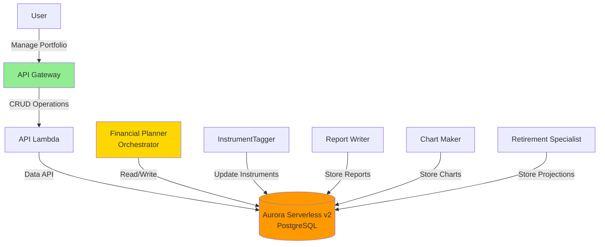
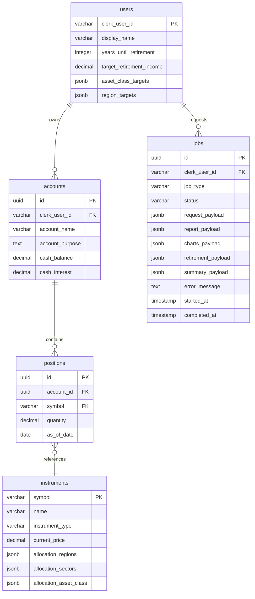

# Building Alex: Part 5 - Database & Shared Infrastructure

Welcome to Part 5! We're now entering the second phase of building Alex - transforming it from a research tool into a complete financial planning SaaS platform. In this guide, we'll set up Aurora Serverless v2 PostgreSQL with the Data API and create a reusable database library that all our AI agents will use.

## REMINDER - MAJOR TIP!!

There's a file `gameplan.md` in the project root that describes the entire Alex project to an AI Agent, so that you can ask questions and get help. There's also an identical `CLAUDE.md` and `AGENTS.md` file. If you need help, simply start your favorite AI Agent, and give it this instruction:

> I am a student on the course AI in Production. We are in the course repo. Read the file `gameplan.md` for a briefing on the project. Read this file completely and read all the linked guides carefully. Do not start any work apart from reading and checking directory structure. When you have completed all reading, let me know if you have questions before we get started.

After answering questions, say exactly which guide you're on and any issues. Be careful to validate every suggestion; always ask for the root cause and evidence of problems. LLMs have a tendency to jump to conclusions, but they often correct themselves when they need to provide evidence.

## Why Aurora Serverless v2 with Data API?

AWS offers several database options, each with different strengths:

### Common AWS Database Services

| Service           | Type            | Best For                                  | Why We Didn't Choose It                                     |
| ----------------- | --------------- | ----------------------------------------- | ----------------------------------------------------------- |
| **DynamoDB**      | NoSQL           | Simple key-value lookups, high-scale apps | No SQL joins, complex for relational data like portfolios   |
| **RDS (Regular)** | Traditional SQL | Predictable workloads, always-on apps     | Requires VPC/networking setup, always running = higher cost |
| **DocumentDB**    | Document NoSQL  | MongoDB-compatible apps                   | Overkill for structured financial data                      |
| **Neptune**       | Graph           | Social networks, recommendation engines   | Wrong fit - we don't need graph relationships               |
| **Timestream**    | Time-series     | IoT, metrics, logs                        | Too specialized for general portfolio data                  |

### Why Aurora Serverless v2 PostgreSQL?

We chose **Aurora Serverless v2 with Data API** because it offers:

1. **No VPC Complexity** - The Data API provides HTTP access, eliminating networking setup
2. **Scales to Zero** - Can pause after inactivity, reducing costs to ~$1.44/day minimum
3. **PostgreSQL** - Full SQL support with JSONB for flexible data (allocation percentages)
4. **Serverless** - Automatically scales with demand, perfect for learning projects
5. **Data API** - Direct HTTP access from Lambda without connection pools or VPC
6. **Pay-per-use** - Only pay for what you use, ideal for development

For students learning AWS, this removes the complexity of VPCs, security groups, and connection management while providing a production-grade database that works seamlessly with Lambda functions.

## What We're Building

In this guide, you'll deploy:

- Aurora Serverless v2 PostgreSQL cluster with Data API enabled (no VPC needed!)
- Complete database schema for portfolios, users, and reports
- Shared database package with Pydantic validation
- Seed data with 22 popular ETFs
- Database reset scripts for easy development

Here's how the database fits into our architecture:



## Prerequisites

Before starting, ensure you have:

- Completed Guides 1-4 (all infrastructure from Parts 1-4)
- AWS CLI configured
- Python with `uv` package manager installed
- Terraform installed
- Docker Desktop installed and running (for local testing)

## Step 0: Additional IAM Permissions

Since Guide 4, we need additional AWS permissions for Aurora and related services.

### Create Custom RDS Policy

1. Sign in to the AWS Console as your root user (just for IAM setup)
2. Navigate to **IAM** → **Policies**
3. Click **Create policy**
4. Click the **JSON** tab
5. Replace the content with:

```json
{
  "Version": "2012-10-17",
  "Statement": [
    {
      "Sid": "RDSPermissions",
      "Effect": "Allow",
      "Action": [
        "rds:CreateDBCluster",
        "rds:CreateDBInstance",
        "rds:CreateDBSubnetGroup",
        "rds:DeleteDBCluster",
        "rds:DeleteDBInstance",
        "rds:DeleteDBSubnetGroup",
        "rds:DescribeDBClusters",
        "rds:DescribeDBInstances",
        "rds:DescribeDBSubnetGroups",
        "rds:DescribeGlobalClusters",
        "rds:ModifyDBCluster",
        "rds:ModifyDBInstance",
        "rds:ModifyDBSubnetGroup",
        "rds:AddTagsToResource",
        "rds:ListTagsForResource",
        "rds:RemoveTagsFromResource",
        "rds-data:ExecuteStatement",
        "rds-data:BatchExecuteStatement",
        "rds-data:BeginTransaction",
        "rds-data:CommitTransaction",
        "rds-data:RollbackTransaction"
      ],
      "Resource": "*"
    },
    {
      "Sid": "EC2Permissions",
      "Effect": "Allow",
      "Action": [
        "ec2:DescribeVpcs",
        "ec2:DescribeVpcAttribute",
        "ec2:DescribeSubnets",
        "ec2:DescribeAvailabilityZones",
        "ec2:DescribeSecurityGroups",
        "ec2:CreateSecurityGroup",
        "ec2:DeleteSecurityGroup",
        "ec2:AuthorizeSecurityGroupIngress",
        "ec2:AuthorizeSecurityGroupEgress",
        "ec2:RevokeSecurityGroupIngress",
        "ec2:RevokeSecurityGroupEgress",
        "ec2:CreateTags",
        "ec2:DescribeTags"
      ],
      "Resource": "*"
    },
    {
      "Sid": "SecretsManagerPermissions",
      "Effect": "Allow",
      "Action": [
        "secretsmanager:CreateSecret",
        "secretsmanager:DeleteSecret",
        "secretsmanager:DescribeSecret",
        "secretsmanager:GetSecretValue",
        "secretsmanager:PutSecretValue",
        "secretsmanager:UpdateSecret"
      ],
      "Resource": "*"
    },
    {
      "Sid": "KMSPermissions",
      "Effect": "Allow",
      "Action": [
        "kms:CreateGrant",
        "kms:Decrypt",
        "kms:DescribeKey",
        "kms:Encrypt"
      ],
      "Resource": "*"
    }
  ]
}
```

6. Click **Next: Tags**, then **Next: Review**
7. For **Policy name**, enter: `AlexRDSCustomPolicy`
8. For **Description**, enter: `RDS and Data API permissions for Alex project`
9. Click **Create policy**

### Add Required AWS Managed Policies

1. Still in IAM, click **User groups** in the left sidebar
2. Click on the `AlexAccess` group (created in Guide 1)
3. Click **Permissions** tab, then **Add permissions** → **Attach policies**
4. Search for and select these AWS managed policies:
   - `AmazonRDSDataFullAccess`
   - `AWSLambda_FullAccess`
   - `AmazonSQSFullAccess`
   - `AmazonEventBridgeFullAccess`
   - `SecretsManagerReadWrite`
5. Also select the custom policy you just created:
   - `AlexRDSCustomPolicy`
6. Click **Add permissions**

### Verify Permissions

Sign out and sign back in with your IAM user, then verify:

```bash
# Should return empty list or existing clusters
aws rds describe-db-clusters

# Should show the command exists and list required parameters
aws rds-data execute-statement --help
# You should see: "the following arguments are required: --resource-arn, --secret-arn, --sql"
# This confirms the Data API commands are available
```

## Step 1: Deploy Aurora Serverless v2

Now let's deploy the database infrastructure with Terraform.

### Configure and Deploy the Database

```bash
# Starting from the project root (alex directory)
cd terraform/5_database

# Copy the example variables file
cp terraform.tfvars.example terraform.tfvars
```

Edit `terraform.tfvars` and set your values:

```hcl
aws_region = "us-east-1"  # Your AWS region
min_capacity = 0.5        # Minimum ACUs (0.5 = ~$43/month)
max_capacity = 1.0        # Maximum ACUs (keep low for dev)
```

Deploy the database:

```bash
# Initialize Terraform (creates local state file)
terraform init

# Deploy the database infrastructure
terraform apply
```

Type `yes` when prompted. This will create:

- Aurora Serverless v2 cluster with Data API enabled
- Database credentials in Secrets Manager
- Security group and subnet configuration
- The `alex` database

Deployment takes about 10-15 minutes. After deployment, Terraform will display important outputs including the cluster ARN and secret ARN.

### Under the hood:

1. Reads AWS Data Sources: Queried AWS API for your current Account ID (aws_caller_identity), the default VPC (aws_vpc), and its associated subnets in us-east-1 (aws_subnets).

2. Generates Execution Plan: Compared your local .tf files with the current AWS state, determining that 11 new resources needed to be created. It then paused for your yes approval.

3. Creates Independent Resources: Rapidly generated random strings for IDs and passwords (random_id, random_password) and created base foundational resources with no dependencies: the Lambda IAM role, the DB Subnet Group, the Aurora Security Group, and the empty Secrets Manager secret.

4. Resolves First-Level Dependencies:

- Stored the generated random password into the new AWS Secret (aws_secretsmanager_secret_version).

- Attached standard Lambda execution policies to the new IAM role.

5. Provisions Aurora Cluster Engine (34s): With the Subnet Group and Security Group ready, it initiated the aws_rds_cluster (the Aurora control plane and storage volume layer).

6. Provisions Aurora Instance Node (6m 15s): Once the cluster was available, it provisioned the actual compute node (aws_rds_cluster_instance) that connects to the cluster. This is the step that took the most time as AWS boots up the underlying serverless DB instance.

7. Completes and Outputs: Terraform saved all the newly generated AWS ARNs into your local terraform.tfstate file and printed the defined variables (ARNs, endpoints, setup instructions) to your terminal.

### Outputs:

```
Example Outputs:

aurora_cluster_arn = "arn:aws:rds:us-east-1:864981739490:cluster:alex-aurora-cluster"
aurora_cluster_endpoint = "alex-aurora-cluster.cluster-clswgeq8kglj.us-east-1.rds.amazonaws.com"
aurora_secret_arn = "arn:aws:secretsmanager:us-east-1:864981739490:secret:alex-aurora-credentials-06c09ce9-cmEpSk"
data_api_enabled = "Enabled"
database_name = "alex"
lambda_role_arn = "arn:aws:iam::864981739490:role/alex-lambda-aurora-role"
setup_instructions = <<EOT

✅ Aurora Serverless v2 cluster deployed successfully!

Database Details:
- Cluster: alex-aurora-cluster
- Database: alex
- Data API: Enabled

Add the following to your .env file:
AURORA_CLUSTER_ARN=arn:aws:rds:us-east-1:864981739490:cluster:alex-aurora-cluster   
AURORA_SECRET_ARN=arn:aws:secretsmanager:us-east-1:864981739490:secret:alex-aurora-credentials-06c09ce9-cmEpSk

Test the Data API connection:
aws rds-data execute-statement \
  --resource-arn arn:aws:rds:us-east-1:864981739490:cluster:alex-aurora-cluster \   
  --secret-arn arn:aws:secretsmanager:us-east-1:864981739490:secret:alex-aurora-credentials-06c09ce9-cmEpSk \
  --database alex \
  --sql "SELECT version()"

To set up the database schema:
cd backend/database
uv run run_migrations.py

To load sample data:
uv run reset_db.py --with-test-data

💰 Cost Management:
- Current scaling: 0.5 - 1 ACUs
- Estimated cost: ~$43/month minimum
- To pause: Set min_capacity to 0 (cluster will pause after 5 minutes of inactivity)
```


### Save Your Configuration

**Important**: Update your `.env` file with the database values:

1. View the Terraform outputs:

   ```bash
   terraform output
   ```

2. Edit the `.env` file in your project root:

   - In Cursor's file explorer, click on the `.env` file in the alex directory
   - If you don't see it, make sure hidden files are visible (Cmd+Shift+. on Mac, Ctrl+H on Linux/Windows)

3. Add these lines with values from Terraform output:
   ```
   # Part 5 - Database
   AURORA_CLUSTER_ARN=arn:aws:rds:us-east-1:123456789012:cluster:alex-aurora-cluster
   AURORA_SECRET_ARN=arn:aws:secretsmanager:us-east-1:123456789012:secret:alex-aurora-credentials-xxxxx
   ```

💡 **Tip**: The exact ARN values are shown in your Terraform output. Copy them carefully!

## Step 2: Initialize the Database

Now let's test the connection and create our schema.

```bash
# Starting from the project root (alex directory)
cd backend/database

# Test the Data API connection
uv run test_data_api.py
```

You should see:

```
✅ Successfully connected to Aurora using Data API!
Database version: PostgreSQL 15.x
```

### Under the hood:
1. Environment Orchestration (uv)

  - Venv Initialization: uv detected that `backend/.venv` was missing or out of sync and created a new virtual environment using CPython 3.12.12.

  - Resolution & Build: It resolved dependencies listed in `pyproject.toml` and built your local `alex-database` package.

  - Installation: It installed 14 wheels into the venv. It attempted "hardlinking" to save space/time, failed (common on Windows OneDrive paths), and fell back to a full copy of the packages.

2. Script Execution

- Context Loading: Python started and loaded environment variables from your root .env file (AURORA_CLUSTER_ARN, AURORA_SECRET_ARN, and AWS credentials).
- AWS Authentication: The script initialized a boto3 client. Since you are signed in as aiengineer, it used those credentials to sign the request to the RDS Data API.

3. AWS Data API Interaction

- Request Routing: The script sent an HTTPS request to the RDS Data Service endpoint in us-east-1.

- Credential Retrieval: The Data API service automatically called AWS Secrets Manager to retrieve the database password using the `AURORA_SECRET_ARN`.

- SQL Execution:
  1. Test 1: Executed `SELECT Now()` to verify the "pipe" to the cluster was open.
  2. Test 2: Queried the `information_schema` to check for tables (returning 0).
  3. Test 3: Queried `pg_database_size` to check the alex database footprint.

- The script is located at: `backend/database/test_data_api.py`. The SQL execution logic is defined in the following lines:

  - Line 129: sql='SELECT 1 as test_connection, current_timestamp as server_time'
  
  - Line 153: sql='SELECT current_database()'
  
  - Lines 170–175:
  ```sql
  SELECT table_name 
  FROM information_schema.tables 
  WHERE table_schema = 'public' 
  ORDER BY table_name
  ```
  
  - Line 198: sql="SELECT pg_database_size('alex') as size_bytes"
  
4. Logic & Output

- Data Serialization: The Data API converted the PostgreSQL results into a JSON response, which the script parsed.

- Result: The script printed the "Success" message to your terminal, confirming your Aurora Serverless cluster is reachable and active.

## Step 3: Run Database Migrations

Create the database schema:

```bash
# From backend/database directory
uv run run_migrations.py
```

You should see:

```
Starting migration: 001_schema.sql
✅ Migration completed successfully
All migrations completed!
```

### Outputs:
```
🚀 Running database migrations...
==================================================

[1/17] Creating extension...
    CREATE EXTENSION IF NOT EXISTS "uuid-ossp"...
    ✅ Success

[2/17] Creating table...
    CREATE TABLE IF NOT EXISTS users (...
    ✅ Success

[3/17] Creating table...
    CREATE TABLE IF NOT EXISTS instruments (...
    ✅ Success

[4/17] Creating table...
    CREATE TABLE IF NOT EXISTS accounts (...
    ✅ Success

[5/17] Creating table...
    CREATE TABLE IF NOT EXISTS positions (...
    ✅ Success

[6/17] Creating table...
    CREATE TABLE IF NOT EXISTS jobs (...
    ✅ Success

[7/17] Creating index...
    CREATE INDEX IF NOT EXISTS idx_accounts_user ON accounts(cle...
    ✅ Success

[8/17] Creating index...
    CREATE INDEX IF NOT EXISTS idx_positions_account ON position...
    ✅ Success

[9/17] Creating index...
    CREATE INDEX IF NOT EXISTS idx_positions_symbol ON positions...
    ✅ Success

[10/17] Creating index...
    CREATE INDEX IF NOT EXISTS idx_jobs_user ON jobs(clerk_user_...
    ✅ Success

[11/17] Creating index...
    CREATE INDEX IF NOT EXISTS idx_jobs_status ON jobs(status)...
    ✅ Success

[12/17] Creating statement...
    CREATE OR REPLACE FUNCTION update_updated_at_column()...
    ✅ Success

[13/17] Creating trigger...
    CREATE TRIGGER update_users_updated_at BEFORE UPDATE ON user...
    ✅ Success

[14/17] Creating trigger...
    CREATE TRIGGER update_instruments_updated_at BEFORE UPDATE O...
    ✅ Success

[15/17] Creating trigger...
    CREATE TRIGGER update_accounts_updated_at BEFORE UPDATE ON a...
    ✅ Success

[16/17] Creating trigger...
    CREATE TRIGGER update_positions_updated_at BEFORE UPDATE ON ...
    ✅ Success

[17/17] Creating trigger...
    CREATE TRIGGER update_jobs_updated_at BEFORE UPDATE ON jobs...
    ✅ Success

==================================================
Migration complete: 17 successful, 0 errors

✅ All migrations completed successfully!

📝 Next steps:
1. Load seed data: uv run seed_data.py
2. Test database operations: uv run test_db.py
```

### Under the hood:

1. **Script Initialization**

    - **Environment Setup:** uv invokes the Python interpreter within your virtual environment.
    
    - **Config Loading:** The script uses `load_dotenv` to fetch `AURORA_CLUSTER_ARN`, `AURORA_SECRET_ARN`, and `AURORA_DATABASE` (alex) from your `.env` file.
    
    - **AWS Client:** It initializes the boto3 client specifically for the `rds-data` service in the `us-east-1` region.

2. **Migration Execution Sequence**

    The script iterates through a static list of 17 SQL statements defined in `statements` (Lines 31–117):

    1. **Extension:** Executes `CREATE EXTENSION IF NOT EXISTS` "uuid-ossp" to enable UUID generation.
    
    2. **Tables:** Iteratively creates `users`, `instruments`, `accounts`, `positions`, and `jobs` tables with specific schemas (Foreign Keys, JSONB types, etc.).

      - **users:** Account settings.

      - **instruments:** ETF metadata (Reference Data).

      - **accounts & positions:** Portfolio holdings.

      - **jobs:** Logs and results for the AI Agent Orchestra.
    
    3. **Indexes:** Creates performance indexes (e.g., `idx_accounts_user`) to speed up user-specific lookups.
    
    4. **Stored Procedures:** Creates the PL/pgSQL function `update_updated_at_column`() to automate timestamp updates.
    
    5. **Triggers:** Attaches `BEFORE UPDATE` triggers to all tables to ensure `updated_at` timestamps are always current.

3. **AWS Data API Processing (Per Statement)**

  For each statement in the loop (Lines 125–158):

    - **API Call:** Calls `client.execute_statement()` which sends the SQL over HTTPS to the RDS Data API.
    
    - **Error Handling:**
    
      - If the command succeeds, it logs ✅ Success.
      
      - If it encounters a "relation already exists" error, it gracefully skips it
      
      - Otherwise, it increments the error counter.

4. **Finalization**
  
    - Summarizes the result (17 successful).
    
    - Displays the next recommended commands (`seed_data.py` and `test_db.py`).

### Summary:

- Terraform (Guide 5, Step 1): Created the actual "Storage Building" (The Aurora Cluster) and the initial empty database named alex.

- Migrations (Step 3): This is a **New Creation**. In development, we use the word "Migration" to mean "changing the state of the database schema." In this case, you "migrated" from 0 tables to 5 tables.

## Step 4: Load Seed Data

Now let's populate the instruments table with 22 popular ETFs:

```bash
# From backend/database directory
uv run seed_data.py
```

You should see:

```
Seeding 22 instruments...
✅ SPY - SPDR S&P 500 ETF
✅ QQQ - Invesco QQQ Trust
✅ BND - Vanguard Total Bond Market ETF
[... more ETFs ...]
✅ Successfully seeded 22 instruments
```

### Outputs:
```
🚀 Seeding Instrument Data
==================================================
Loading 22 instruments...

📊 Verifying allocation data...
  ✅ All allocations valid!

💾 Inserting instruments...
  [1/22] SPY: SPDR S&P 500 ETF Trust...
    ✅ Success
  [2/22] QQQ: Invesco QQQ Trust...
    ✅ Success
  [3/22] IWM: iShares Russell 2000 ETF...
    ✅ Success
  [4/22] VEA: Vanguard FTSE Developed Markets ETF...
    ✅ Success
  [5/22] VWO: Vanguard FTSE Emerging Markets ETF...
    ✅ Success
  [6/22] EFA: iShares MSCI EAFE ETF...
    ✅ Success
  [7/22] AGG: iShares Core U.S. Aggregate Bond ETF...
    ✅ Success
  [8/22] BND: Vanguard Total Bond Market ETF...
    ✅ Success
  [9/22] TLT: iShares 20+ Year Treasury Bond ETF...
    ✅ Success
  [10/22] HYG: iShares iBoxx High Yield Corporate Bond ...
    ✅ Success
  [11/22] XLK: Technology Select Sector SPDR Fund...
    ✅ Success
  [12/22] XLV: Health Care Select Sector SPDR Fund...
    ✅ Success
  [13/22] XLF: Financial Select Sector SPDR Fund...
    ✅ Success
  [14/22] XLE: Energy Select Sector SPDR Fund...
    ✅ Success
  [15/22] VNQ: Vanguard Real Estate ETF...
    ✅ Success
  [16/22] GLD: SPDR Gold Shares...
    ✅ Success
  [17/22] SLV: iShares Silver Trust...
    ✅ Success
  [18/22] AOR: iShares Core Growth Allocation ETF...
    ✅ Success
  [19/22] AOA: iShares Core Aggressive Allocation ETF...
    ✅ Success
  [20/22] VUG: Vanguard Growth ETF...
    ✅ Success
  [21/22] VTV: Vanguard Value ETF...
    ✅ Success
  [22/22] VIG: Vanguard Dividend Appreciation ETF...
    ✅ Success

==================================================
Seeding complete: 22/22 instruments loaded

🔍 Verifying data...
  Database now contains 22 instruments

  Sample instruments:
    - AGG: iShares Core U.S. Aggregate Bond ETF
    - AOA: iShares Core Aggressive Allocation ETF
    - AOR: iShares Core Growth Allocation ETF
    - BND: Vanguard Total Bond Market ETF
    - EFA: iShares MSCI EAFE ETF

✅ Seed data loaded successfully!

📝 Next steps:
1. Create test user and portfolio: uv run create_test_data.py
2. Test database operations: uv run test_db.py
```

### Under the hood:
1. Preparation
    
    - Environment: uv invokes Python with your virtual environment.
  
    - AWS Client: boto3 initializes a connection to the `rds-data` service in `us-east-1` using ARNs from `.env`.
    
    - Pre-flight Validation: The script iterates through a local list of 22 ETFs (`INSTRUMENTS`). It uses **Pydantic validation** (`InstrumentCreate` schema) to verify that all region, sector, and asset class percentages are correct before calling AWS.

2. The Upsert Loop (Per Instrument)
  For each ETF (e.g., SPY, QQQ):

    - **Data Serialization:** Local dictionaries for allocations are converted to JSON strings using `json.dumps`.
    
    - **SQL Generation:** It builds an `INSERT INTO instruments ... ON CONFLICT (symbol) DO UPDATE` query. This "Upsert" pattern ensures new instruments are added and existing ones are updated without errors.
    
    - **Parameterized API Call:** It calls `client.execute_statement()`. Instead of raw strings, it uses **typed parameters** (e.g., `stringValue` for JSON blocks and `stringValue` cast to `::numeric` for prices) to prevent SQL injection and formatting errors in the Data API.

3. Post-Insert Verification
  Once the loop completes, the script performs two final "Under the hood" SQL checks:

    - Count Check: Executes `SELECT COUNT(*) FROM instruments` to confirm exactly 22 records exist.
    
    - Sample Retrieval: Executes `SELECT symbol, name FROM instruments ORDER BY symbol LIMIT 5` to fetch a small set of data to display as proof of success.

4. Output

  - Prints the sample instruments.
  
  - Displays recommended next steps (`create_test_data.py`).

### Why use the seed_data instruments:

These 22 instruments are the **Reference Data** (Master Data) that the entire "Alex" platform depends on.

Here is why they are critical:

1.  **Metadata for Agents**: Each instrument includes a detailed breakdown of its **Asset Allocation** (Sectors, Regions, and Asset Classes). For example, the seed data tells the database that `SPY` is **28% Technology** and **100% North America**.
2.  **Portfolio Analysis**: When you later create a "test portfolio" with these symbols, the **Reporter Agent** and **Charter Agent** use this seed data to calculate your total exposure. If you didn't have this "seed" data, the agents wouldn't know how to categorize your holdings.
3.  **Real-World Accuracy**: These are popular, real-world ETFs (SPY, QQQ, VWO, AGG, etc.) with realistic percentages. This allows you to generate professional-looking financial reports and charts that actually make sense.

In short: the seed data turns a list of ticker symbols into **actionable financial intelligence** for the AI agents.

## Step 5: Create Test Data (Optional)

For development, let's create a test user with a sample portfolio:

```bash
# From backend/database directory
uv run reset_db.py --with-test-data
```

You should see:

```
Dropping all tables...
Running migrations...
Loading default instruments...
Creating test user with portfolio...
✅ Database reset complete with test data!

Test user created:
- User ID: test_user_001
- Display Name: Test User
- 3 accounts (401k, Roth IRA, Taxable)
- 5 positions in 401k account
```

### Output:
```
🚀 Database Reset Script
==================================================
🗑️  Dropping existing tables...
   ✅ Dropped positions
   ✅ Dropped accounts
   ✅ Dropped jobs
   ✅ Dropped instruments
   ✅ Dropped users
   ✅ Dropped update_updated_at_column function

📝 Running migrations...
✅ Migrations completed

🌱 Loading seed data...
✅ Loaded 22 instruments

👤 Creating test user and portfolio...
   ✅ Created test user
   ✅ Created account: 401(k)
   ✅ Created account: Roth IRA
   ✅ Created account: Taxable Brokerage
   ✅ Added position: 100 shares of SPY
   ✅ Added position: 50 shares of QQQ
   ✅ Added position: 200 shares of BND
   ✅ Added position: 150 shares of VEA
   ✅ Added position: 25 shares of GLD

🔍 Final verification...
   • users: 1 records
   • instruments: 22 records
   • accounts: 3 records
   • positions: 5 records
   • jobs: 0 records

==================================================
✅ Database reset complete!

📝 Test user created:
   • User ID: test_user_001
   • 3 accounts (401k, Roth IRA, Taxable)
   • 5 positions in 401k account
```

### Under the hood:

#### 1. The "Wipe and Rebuild" Sequence
1.  **Drop Tables (CASCADE)**: The script sends `DROP TABLE IF EXISTS ... CASCADE` commands to Aurora for all 5 tables (`positions`, `accounts`, `jobs`, `instruments`, `users`). This clears any previous or corrupted data.
2.  **Schema Re-creation**: It automatically invokes the logic from `run_migrations.py` to rebuild the extension, tables, indexes, and triggers from scratch.
3.  **Core Seeding**: It invokes the logic from `seed_data.py` to reload the 22 "Master Reference" ETFs.
4.  **Test Data Injection**: Since you included the `--with-test-data` flag, it executes a series of `INSERT` statements to create:
    *   A user profile (`test_user_001`).
    *   Three distinct accounts (401k, Roth IRA, Brokerage).
    *   Five specific equity and bond positions (SPY, QQQ, etc.) linked to the 401(k) account.
5.  **Final Audit**: It runs a verification query to print the record counts in your terminal, confirming the database is populated.

#### 2. Why this is necessary for the Reporter Agent (Guide 6):
The **Reporter Agent**'s primary job is to generate a detailed analysis of a user's holdings. 

If you don't run this script:
*   **The Database is empty**: The Agent would find 0 accounts and 0 positions.
*   **No "Test Subject"**: You wouldn't have the `test_user_001` ID required to trigger the agent's tools.
*   **No Portfolio Breakdown**: Since the Reporter uses the seed data to calculate sector/region exposure, it needs both the **Positions** (what you own) and the **Master Instruments** (what those things are) to be linked and present.

**In summary**: This script builds the "Demo World" that the Reporter Agent needs to perform its analysis.


## Step 6: Verify Database Integrity

Finally, run the verification script to get a full report on the database's health. This is a valuable check to confirm
everything is set up correctly before you proceed to Part 6.

```bash
1 # From backend/database directory
2 uv run verify_database.py
```

The script will output a detailed report summarizing table counts, data integrity, and more. The key thing to look for is the
final confirmation banner at the end of the report:

```bash
---
🎉 DATABASE VERIFICATION COMPLETE
---
✅ All tables created successfully
✅ Instruments loaded with complete allocation data
✅ All allocation percentages sum to 100%
✅ Indexes and triggers are in place
✅ Database is ready for Part 6: Agent Orchestra!
```

### Outputs
```
🔍 DATABASE VERIFICATION REPORT 
======================================================================
📍 Region: us-east-1
📦 Database: alex
======================================================================

📊 ALL TABLES IN DATABASE
--------------------------------------------------
✅ Found 5 tables:

   • accounts             Size: 24 kB
   • instruments          Size: 32 kB
   • jobs                 Size: 32 kB
   • positions            Size: 32 kB
   • users                Size: 16 kB

📈 RECORD COUNTS PER TABLE
--------------------------------------------------

Table record counts:

   📭 accounts             0 records
   ✅ instruments          22 records
   📭 jobs                 0 records
   📭 positions            0 records
   📭 users                0 records

🎯 SAMPLE INSTRUMENTS (First 10)
--------------------------------------------------

Symbol | Name | Type | Asset Class Allocation
----------------------------------------------------------------------
AGG    | iShares Core U.S. Aggregate Bond ET | bond_fund  | {"fixed_income": 100.0} 
AOA    | iShares Core Aggressive Allocation  | etf        | {"equity": 80.0, "fixed_income": 20.0}
AOR    | iShares Core Growth Allocation ETF  | etf        | {"equity": 60.0, "fixed_income": 40.0}
BND    | Vanguard Total Bond Market ETF      | bond_fund  | {"fixed_income": 100.0} 
EFA    | iShares MSCI EAFE ETF               | etf        | {"equity": 100.0}       
GLD    | SPDR Gold Shares                    | etf        | {"commodities": 100.0}  
HYG    | iShares iBoxx High Yield Corporate  | bond_fund  | {"fixed_income": 100.0} 
IWM    | iShares Russell 2000 ETF            | etf        | {"equity": 100.0}       
QQQ    | Invesco QQQ Trust                   | etf        | {"equity": 100.0}       
SLV    | iShares Silver Trust                | etf        | {"commodities": 100.0}  

✅ ALLOCATION VALIDATION (Sample ETFs)
--------------------------------------------------

Verifying allocations sum to 100%:

Symbol | Regions | Sectors | Assets | Status
--------------------------------------------------
SPY    |   100.0% |   100.0% |  100.0% | ✅ Valid
QQQ    |   100.0% |   100.0% |  100.0% | ✅ Valid
VEA    |   100.0% |   100.0% |  100.0% | ✅ Valid
BND    |   100.0% |   100.0% |  100.0% | ✅ Valid
GLD    |   100.0% |   100.0% |  100.0% | ✅ Valid

📊 ASSET CLASS DISTRIBUTION
--------------------------------------------------

Instrument breakdown by asset class:

   • Pure Equity ETFs:       13
   • Pure Bond Funds:         4
   • Real Estate ETFs:        1
   • Commodity ETFs:          2
   • Mixed Allocation ETFs:   2
   -------------------------
   • TOTAL INSTRUMENTS:      22

🔍 DATABASE INDEXES
--------------------------------------------------

✅ Found 5 custom indexes

⚡ DATABASE TRIGGERS
--------------------------------------------------

✅ Found 5 update triggers for timestamp management

======================================================================
🎉 DATABASE VERIFICATION COMPLETE
======================================================================

✅ All tables created successfully
✅ 22 instruments loaded with complete allocation data
✅ All allocation percentages sum to 100%
✅ Indexes and triggers are in place
✅ Database is ready for Part 6: Agent Orchestra!
```

### Under the hood:

#### What `uv run verify_database.py` does:
This script performs a **comprehensive audit** of your database to ensure the "Blueprint" was correctly built and stocked.

**Under the Hood (Code Sequence):**
1.  **System Audit**: Queries `information_schema.tables` and `pg_total_relation_size` to confirm your 5 tables exist and have physical storage allocated.
2.  **Inventory Count**: Runs a `UNION ALL` query to fetch record counts for all tables simultaneously.
3.  **Data Quality Check (JSONB Math)**: Uses PostgreSQL's `jsonb_each_text` to programmatically sum up the percentages inside the JSON blocks for 5 select ETFs. It mathematically verifies that `Regions`, `Sectors`, and `Assets` each sum to exactly **100.0%**.
4.  **Schema Engineering Check**: Inspects the `pg_indexes` and `information_schema.triggers` system catalogs to verify that the `idx_` performance indexes and timestamp-management triggers were successfully created during migration.
5.  **Final Report**: Aggregates all successes into the clean summary you see in your terminal.

---

#### Why the "Next Steps" mismatch?
**Short answer**: The scripts and the guide are maintained separately.

*   **The Scripts**: The `print` statements at the end of `seed_data.py` were written by the developer to suggest a generic testing flow (`create_test_data.py` -> `test_db.py`).
*   **The Guide**: Guide 5 was specifically written for this course to use `verify_database.py` as a single "clean" verification step before moving to Part 6. 


## Understanding the Database Schema

Our schema includes five tables with clear separation between user-specific and shared reference data:



### Table Descriptions

- **users**: Minimal user data (Clerk handles auth)
- **instruments**: ETFs, stocks, and funds with current prices and allocation data (shared reference data)
- **accounts**: User's investment accounts (401k, IRA, etc.)
- **positions**: Holdings in each account
- **jobs**: Async job tracking for analysis requests with separate fields for each agent's output:
  - `report_payload`: Reporter agent's markdown analysis
  - `charts_payload`: Charter agent's visualization data
  - `retirement_payload`: Retirement agent's projections
  - `summary_payload`: Planner's final summary and metadata

All data is validated through Pydantic schemas before database insertion, ensuring data integrity. Each agent writes its results to its own dedicated JSONB field in the `jobs` table, eliminating the need for complex merging logic. Agent execution tracking is handled by LangFuse and CloudWatch Logs, not in the database.

## Cost Management

Aurora Serverless v2 costs approximately:

- **Minimum capacity (0.5 ACU)**: ~$43/month
- **Running normally**: $1.44-$2.88/day

### Managing Costs

To minimize costs when not actively developing:

```bash
# To completely destroy the database and stop all charges:
cd terraform/5_database
terraform destroy

# To recreate the database later:
terraform apply
```

⚠️ **Warning**: `terraform destroy` will delete your database and all data. Only do this when you're done with development or taking a break.

**Recommendation**: Complete Parts 5-8 within 3-5 days, then destroy to avoid ongoing charges.

## Troubleshooting

### Data API Connection Issues

If you can't connect to the Data API:

1. **Check cluster status**:

```bash
aws rds describe-db-clusters --db-cluster-identifier alex-aurora-cluster
```

Status should be "available"

2. **Check Data API is enabled**:

```bash
aws rds describe-db-clusters --db-cluster-identifier alex-aurora-cluster --query 'DBClusters[0].EnableHttpEndpoint'
```

Should return `true`

3. **Verify secrets** (the secret name includes a random suffix):

```bash
# List all secrets to find the correct name
aws secretsmanager list-secrets --query "SecretList[?contains(Name, 'alex-aurora-credentials')].Name"

# Then get the secret value (replace with actual name from above)
aws secretsmanager get-secret-value --secret-id alex-aurora-credentials-xxxxx --query SecretString --output text | jq .
```

Should show username and password

### Migration Failures

If migrations fail:

1. **Check SQL syntax**:

```bash
# From the backend/database directory
# Migrations are in the migrations subdirectory
cat migrations/001_schema.sql
```

2. **Reset and retry**:

```bash
# From the backend/database directory
uv run reset_db.py
# This will drop all tables, run migrations, and reload seed data
```

### Pydantic Validation Errors

If you see validation errors:

1. **Check allocation sums**:
   All allocation dictionaries must sum to 100.0

2. **Check Literal types**:
   Only use allowed values for regions, sectors, and asset classes

3. **Review schema definitions**:

```bash
# From the backend/database directory
cat src/schemas.py
```

## Next Steps

Excellent! You now have a production-grade database with:

- ✅ Aurora Serverless v2 with Data API (no VPC complexity!)
- ✅ Complete schema for financial data
- ✅ Pydantic validation for all data
- ✅ 22 ETFs with allocation data
- ✅ Shared database package for all agents

Continue to [6_agents.md](6_agents.md) where we'll build the AI agent orchestra that uses this database to provide comprehensive financial analysis!

Your database is ready and waiting for the agents! 🚀
