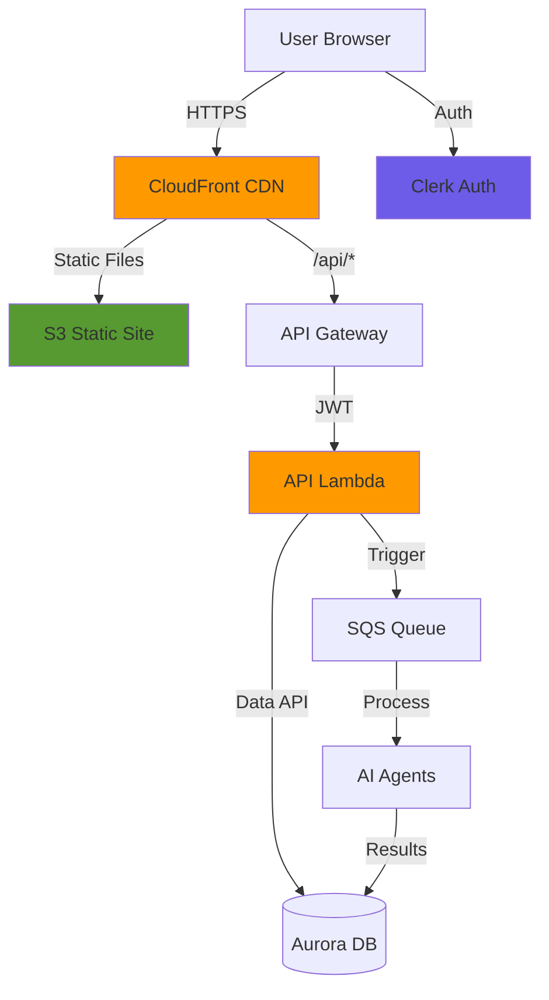

# Building Alex: Part 7 - Frontend & API

Welcome to the final development phase! In this guide, you'll deploy the user interface that brings Alex to life - a modern React application with real-time agent visualization, portfolio management, and comprehensive financial analysis displays.

## REMINDER - MAJOR TIP!!

There's a file `gameplan.md` in the project root that describes the entire Alex project to an AI Agent, so that you can ask questions and get help. There's also an identical `CLAUDE.md` and `AGENTS.md` file. If you need help, simply start your favorite AI Agent, and give it this instruction:

> I am a student on the course AI in Production. We are in the course repo. Read the file `gameplan.md` for a briefing on the project. Read this file completely and read all the linked guides carefully. Do not start any work apart from reading and checking directory structure. When you have completed all reading, let me know if you have questions before we get started.

After answering questions, say exactly which guide you're on and any issues. Be careful to validate every suggestion; always ask for the root cause and evidence of problems. LLMs have a tendency to jump to conclusions, but they often correct themselves when they need to provide evidence.

## What You're Building

You'll deploy a complete SaaS frontend with:
- **Authentication**: Clerk-based sign-in/sign-up with automatic user creation
- **Portfolio Management**: Add accounts, track positions, edit holdings
- **AI Analysis**: Trigger and monitor multi-agent analysis with real-time progress
- **Interactive Reports**: Markdown reports, dynamic charts, retirement projections
- **Production Infrastructure**: CloudFront CDN, API Gateway, Lambda backend

Here's the complete architecture:



## Prerequisites

Before starting, ensure you have:
- Completed Guides 1-6 (all backend infrastructure deployed)
- AWS CLI configured
- Node.js 20+ and npm installed
- Python with `uv` package manager
- Terraform installed
- A Clerk account (free tier is fine)

## Step 1: Set Up Clerk Authentication

We'll use Clerk for authentication - the same service from earlier in the course. If you already have Clerk credentials from a previous project, you can reuse them.

### 1.1 Get Your Clerk Credentials

If you have Clerk credentials from a previous project:
1. Sign in to [Clerk Dashboard](https://dashboard.clerk.com)
2. Select your existing application
3. Navigate to **API Keys** in the left sidebar
4. You'll need:
   - Publishable Key (starts with `pk_`)
   - Secret Key (starts with `sk_`)
   - JWKS Endpoint URL (found under **Show JWT Public Key** → **JWKS Endpoint**)

If you need to create a new Clerk application:
1. Sign up at [clerk.com](https://clerk.com)
2. Create a new application
3. Choose **Email** and optionally **Google** for sign-in methods
4. Get your keys from the API Keys section

### 1.2 Configure Frontend Environment

Create `.env.local` in the frontend directory in Cursor and add your Clerk credentials:

```bash
# Clerk Authentication (use your existing keys if you have them)
NEXT_PUBLIC_CLERK_PUBLISHABLE_KEY=pk_test_your-key-here
CLERK_SECRET_KEY=sk_test_your-secret-here

# Sign-in/up redirects (these are already set correctly)
NEXT_PUBLIC_CLERK_AFTER_SIGN_IN_URL=/dashboard
NEXT_PUBLIC_CLERK_AFTER_SIGN_UP_URL=/dashboard

# API URL - use localhost for local development, AWS URL for production
NEXT_PUBLIC_API_URL=http://localhost:8000
```

### 1.3 Configure Backend Environment

Now add Clerk configuration to your root `.env` file:

```bash
# In your alex directory root .env file, add:

# Part 7 - Clerk Authentication (using darrendtjw2023@gmail.com)
CLERK_JWKS_URL=https://modern-reindeer-10.clerk.accounts.dev/.well-known/jwks.json
CLERK_ISSUER=https://modern-reindeer-10.clerk.accounts.dev
```

To find your JWKS URL:
1. Go to Clerk Dashboard → **API Keys**
2. Click **Show JWT Public Key**
3. Copy the **JWKS Endpoint** URL

## Step 2: Test Frontend Locally

Let's verify the frontend works before deploying.

### 2.1 Install Dependencies

Navigate to the frontend directory and install packages:

```bash
# In alex/frontend directory
npm install
```

This installs React, NextJS, Tailwind CSS, and other dependencies.

### 2.2 Start Development Servers

We'll run both the backend API and frontend together:

```bash
# Navigate to scripts directory
# Go to alex/scripts in your terminal

# Start both frontend and backend
uv run run_local.py
```

You should see:
```
🚀 Starting FastAPI backend...
  ✅ Backend running at http://localhost:8000
     API docs: http://localhost:8000/docs

🚀 Starting NextJS frontend...
  ✅ Frontend running at http://localhost:3000
```

### Fixes and Under the hood:

### Issues & Fixes
| Issue | Root Cause | Fix Applied |
| :--- | :--- | :--- |
| **`npm` command not found** | Python's `subprocess` cannot blindly execute batch scripts (`npm.cmd`) on Windows without `.cmd` specified or `shell=True`. | Setup an OS check to map `"npm"` to `"npm.cmd"` strictly on Windows environments. |
| **Immediate crash (`WinError 10038`)** | `select.select()` on Windows only supports network sockets, yet the script attempted to use it on the stdout pipes of the frontend subprocess. | Removed `select` entirely. Handled NextJS boot-up checks with `httpx.get` instead, and shifted log-streaming to non-blocking daemon `threading` streams. |
| **Silent crashes on subsequent runs** | On Windows, `proc.terminate()` alongside `shell=True` only kills the `cmd.exe` wrapper, leaving Node and Uvicorn alive in the background permanently occupying ports `3000`/`8000` (zombies). | Hard-killed existing zombies via terminal, then rewrote the `cleanup` function to execute `taskkill /PID <id> /F /T` on Windows to fully kill the process tree. |

---

### Why were packages moving?
The logs detailing `Resolved 122 packages... Uninstalled 82 packages...` occurred because of `uv`. 
You ran the script from `scripts/.venv`, but the backend relies on its own `backend/.venv`. `uv` automatically isolated the environments, bypassed the script's virtual environment, and aggressively synced the specific dependencies required strictly by `main.py` directly into the backend folder before booting.

---

### Sequence of `uv run run_local.py`
Here is what technically happens under the hood when you execute the script:
1. **Host Verification:** Validates that `node`, `npm`, and `uv` binaries exist in the system `PATH`.
2. **Environment Verification:** Checks that `/.env` and `/frontend/.env.local` exist. Downloads the `httpx` package locally if required.
3. **Backend Startup:** Triggers `uv sync` inside the `/backend/api/` directory. Pointers execute `uv run main.py` in a subprocess. Pings `http://localhost:8000/health` in a loop until a HTTP 200 is received. 
4. **Frontend Startup:** Checks for `/frontend/node_modules/`. Spawns `npm.cmd run dev` *(as a Windows shell)*. Runs `httpx` pings to `http://localhost:3000` until it is completely online.
5. **Log Streaming:** A daemon thread `stream_logs` is started, reading `stdout` buffers live from both processes and surfacing them to your terminal line-by-line.
6. **Graceful Deconstruction:** While looping indefinitely, it listens for Process panics or Keyboard Interrupts (`Ctrl+C`). Upon trigger, it invokes the OS-specific cleanup protocol to hard kill both servers and child threads.


### 2.3 Explore the Application

Open your browser and visit [http://localhost:3000](http://localhost:3000)

1. **Landing Page**: You'll see the Alex AI Financial Advisor homepage
2. **Sign In**: Click "Sign In" and create an account or use existing Clerk credentials
3. **Dashboard**: After sign-in, you're redirected to the dashboard
4. **User Creation**: The system automatically creates your user profile in the database

### 2.4 Explore API Documentation

Open [http://localhost:8000/docs](http://localhost:8000/docs) to see the Swagger API documentation.

This interactive documentation shows:
- All available API endpoints
- Request/response schemas
- Authentication requirements
- Try-it-out functionality (requires JWT token)

Key endpoints:
- `GET /api/user` - Get or create user profile
- `GET /api/accounts` - List investment accounts
- `POST /api/positions` - Add positions to accounts
- `POST /api/analyze` - Trigger AI analysis
- `GET /api/jobs/{job_id}` - Check analysis status

#### More on Swagger UI:

FastAPI, the framework used for your backend, automatically generates interactive **Swagger UI** documentation at the `/docs` endpoint by default. It parses your Python type hints and route decorators (like `@app.get("/api/user")`) in `main.py` to create this live, testable map of your API.

## Step 3: Add Test Portfolio Data

Let's create a sample portfolio to work with.

### 3.1 Navigate to Accounts Page

1. Click **Accounts** in the navigation bar
2. You'll see "No accounts found"
3. Click **Populate Test Data** button

The system creates:
- 3 accounts (401k, Roth IRA, Taxable)
- Various ETF and stock positions
- Cash balances

### 3.2 Explore Account Management

Click on any account to:
- View positions with current values
- Edit position quantities
- Add new positions
- Delete positions
- Update cash balance

Try editing a position:
1. Click the edit icon next to any position
2. Change the quantity
3. Click save
4. See the value update automatically

**Note**: The AI analysis features require the AWS infrastructure to be deployed. You can explore portfolio management locally, but analysis will only work after deployment.

## Step 4: Deploy Infrastructure

Now let's deploy to AWS for production use.

### 4.1 Configure Terraform

Navigate to the terraform directory for Part 7:

```bash
# Go to alex/terraform/7_frontend directory

# Copy example variables
cp terraform.tfvars.example terraform.tfvars
```

Edit `terraform.tfvars` in Cursor:

```hcl
# AWS region for deployment
aws_region = "us-east-1"

# Clerk configuration for JWT validation
# Get these from your Clerk dashboard
# The JWKS URL is: https://[your-instance].clerk.accounts.dev/.well-known/jwks.json
# The issuer is: https://[your-instance].clerk.accounts.dev
clerk_jwks_url = "https://engaging-feline-80.clerk.accounts.dev/.well-known/jwks.json"
clerk_issuer   = "https://engaging-feline-80.clerk.accounts.dev"
```

To find your AWS account ID:
```bash
aws sts get-caller-identity --query Account --output text
```

---

### 4.2 Package the API Lambda

Navigate to the backend/api directory and package the Lambda:

```bash
# In alex/backend/api directory
uv run package_docker.py
```

This creates `api_lambda.zip` with all dependencies. Takes about 1 minute.

#### Outputs:
```
API directory: C:\Users\User\OneDrive - Universitat Ramón Llull\Desktop\Learning\Github-2026\Agentic-Rag-Financial-Planner\backend\api
Backend directory: C:\Users\User\OneDrive - Universitat Ramón Llull\Desktop\Learning\Github-2026\Agentic-Rag-Financial-Planner\backend
Running: docker info
Packaging in: C:\Users\User\AppData\Local\Temp\tmp5d9paax1\package
Copied database package from C:\Users\User\OneDrive - Universitat Ramón Llull\Desktop\Learning\Github-2026\Agentic-Rag-Financial-Planner\backend\database\src
Building Docker image for x86_64 architecture...
Running: docker build --platform linux/amd64 -t alex-api-packager .
Extracting Lambda package...
Running: docker rm -f alex-api-extract
Running: docker create --name alex-api-extract alex-api-packager
Running: docker cp alex-api-extract:/var/task/. C:\Users\User\AppData\Local\Temp\tmp5d9paax1\lambda
Running: docker rm -f alex-api-extract
Creating zip file: C:\Users\User\OneDrive - Universitat Ramón Llull\Desktop\Learning\Github-2026\Agentic-Rag-Financial-Planner\backend\api\api_lambda.zip   
✅ Lambda package created: C:\Users\User\OneDrive - Universitat Ramón Llull\Desktop\Learning\Github-2026\Agentic-Rag-Financial-Planner\backend\api\api_lambda.zip (22.22 MB)

Package contents (first 20 files):
  - Dockerfile
  - lambda_handler.py
  - requirements.txt
  - six.py
  - typing_extensions.py
  - _cffi_backend.cpython-312-x86_64-linux-gnu.so
  - annotated_doc/main.py
  - annotated_doc/py.typed
  - annotated_doc/__init__.py
  - annotated_doc-0.0.4.dist-info/entry_points.txt
  - annotated_doc-0.0.4.dist-info/INSTALLER
  - annotated_doc-0.0.4.dist-info/METADATA
  - annotated_doc-0.0.4.dist-info/RECORD
  - annotated_doc-0.0.4.dist-info/WHEEL
  - annotated_doc-0.0.4.dist-info/licenses/LICENSE
  - annotated_types/py.typed
  - annotated_types/test_cases.py
  - annotated_types/__init__.py
  - annotated_types-0.7.0.dist-info/INSTALLER
  - annotated_types-0.7.0.dist-info/METADATA
  ... and 2738 more files
```

#### Under the hood:

Here is the exact step-by-step sequence of what happens under the hood when you run `uv run package_docker.py` in the `backend/api` directory:

1. **Path Setup & Verification**: Calculates the paths for the API, backend, and project root directories. Runs `docker info` to verify that Docker Desktop is actively running.
2. **Temporary Directory Creation**: Creates a temporary folder locally to isolate the build and packaging files without polluting the project directory.
3. **Source Code Copying**: 
   - Copies the contents of `backend/api` into `[temp]/package/api` (ignoring `.env`, `.pyc`, `test_*.py`, etc.).
   - Copies `lambda_handler.py` into the root of the temp package folder so AWS Lambda can discover it.
   - Copies the shared database code from `backend/database/src` into `[temp]/package/src`.
4. **Requirements & Dockerfile Generation**:
   - Programmatically generates a `requirements.txt` file (fastapi, uvicorn, mangum, boto3, fastapi-clerk-auth, pydantic, python-dotenv).
   - Generates a `Dockerfile` based on `public.ecr.aws/lambda/python:3.12` that is set to install dependencies to `/var/task`.
5. **Docker Image Build**: Runs `docker build --platform linux/amd64` to build an image named `alex-api-packager`. This ensures the compiled dependencies (like `pydantic-core`) are built specifically for the Amazon Linux `amd64` Lambda architecture rather than your host OS architecture.
6. **Artifact Extraction**:
   - Creates a stopped container named `alex-api-extract` from the newly built image.
   - Uses `docker cp` to copy the `/var/task` directory block out of the container back into a local temp `lambda/` extraction directory.
   - Removes the container.
7. **Zip Archive Creation**:
   - Iterates through the extracted `lambda/` folder and creates `api_lambda.zip` inside `backend/api/` using Python's `zipfile` module (while deliberately skipping `__pycache__` and `.pyc` files).
   - Prints a validation summary showing the file size and the first 20 files inside the zip.

---

### 4.3 Deploy Infrastructure

Navigate back to the terraform directory and deploy:

```bash
# In alex/terraform/7_frontend directory

# Initialize Terraform
terraform init

# Review what will be created
terraform plan

# Deploy infrastructure
terraform apply
```

Type `yes` when prompted. This creates:
- S3 bucket for static frontend
- CloudFront CDN distribution
- API Gateway with Lambda integration
- Lambda function for API
- IAM roles and policies

Deployment takes 10-15 minutes (CloudFront takes time).

#### Outputs:
```
Outputs:

api_gateway_url = "https://rfez3grs71.execute-api.us-east-1.amazonaws.com"    
cloudfront_url = "https://d2xacuj8kx2e3l.cloudfront.net"
lambda_function_name = "alex-api"
s3_bucket_name = "alex-frontend-864981739490"
setup_instructions = <<EOT

✅ Frontend & API infrastructure deployed successfully!

CloudFront URL: https://d2xacuj8kx2e3l.cloudfront.net
API Gateway: https://rfez3grs71.execute-api.us-east-1.amazonaws.com
S3 Bucket: alex-frontend-864981739490
Lambda Function: alex-api

Next steps:

1. If you deployed manually (not using scripts/deploy.py):
   a. Build and deploy the frontend:
      cd frontend
      npm run build
      aws s3 sync out/ s3://alex-frontend-864981739490/ --delete

   b. Invalidate CloudFront cache:
      aws cloudfront create-invalidation \
        --distribution-id EK6IDEP723KK1 \
        --paths "/*"

2. Test the deployment:
   - Visit: https://d2xacuj8kx2e3l.cloudfront.net
   - Sign in with Clerk
   - Check API calls in Network tab

3. Monitor in AWS Console:
   - CloudWatch Logs: /aws/lambda/alex-api
   - API Gateway metrics
   - CloudFront metrics

To destroy: cd scripts && uv run destroy.py

EOT
```

#### Under the hood:

Terraform executes the following operations in sequence based on the dependency graph in `main.tf`:

1.  **State Initialization & Context**: 
    - Reads `terraform.tfvars`, fetches the account ID via `data.aws_caller_identity`, and retrieves resource ARNs (Aurora and SQS) from the `local` remote state files of Parts 5 and 6.
2.  **IAM Infrastructure (Parallelizable)**:
    - Creates the `aws_iam_role.api_lambda_role`.
    - Once the role is active, it creates four policies: `api_lambda_basic` (logging), `api_lambda_aurora` (database access), `api_lambda_sqs` (job queuing), and `api_lambda_invoke` (direct agent testing).
3.  **S3 \& Storage (Parallelizable)**:
    - Provisions the `aws_s3_bucket.frontend`.
    - Configures it for static hosting (`aws_s3_bucket_website_configuration`).
    - Unblocks public access and applies a bucket policy allowing public `s3:GetObject` (PublicReadGetObject).
4.  **API Gateway Foundation**:
    - Creates the `aws_apigatewayv2_api` (HTTP protocol) with global CORS configuration.
    - Provisions the `$default` stage with auto-deployment and throttling limits.
5.  **CloudFront Distribution (Long-running)**:
    - Provisions the `aws_cloudfront_distribution`. It defines two origins: the S3 website endpoint (for static assets) and the API Gateway endpoint (for `/api/*` paths). 
    - *Note*: This takes ~3 minutes as it propagates globally.
6.  **Lambda Deployment**:
    - Once the IAM role, CloudFront distribution, and policies are ready, it uploads `api_lambda.zip` and creates the `aws_lambda_function.api`. 
    - It injects environment variables (Database ARNs, SQS URL, Clerk URLs, and the CloudFront domain for CORS).
7.  **Integration & Routing**:
    - Links the API Gateway to the Lambda via `aws_apigatewayv2_integration`.
    - Creates the `ANY` and `OPTIONS` routes under `/api/*`.
    - Finally, it adds `aws_lambda_permission.api_gw` to allow the API Gateway to invoke the Lambda function.

---

### 4.4 Save Important Outputs

After deployment, save the outputs:

```bash
terraform output
```

You'll see:
- `cloudfront_url` - Your frontend URL
- `api_gateway_url` - Your API endpoint
- `s3_bucket` - Frontend bucket name

Also update your root `.env` file with the SQS queue URL from Part 6:

```bash
# Check Part 6 outputs if you don't have this
# In alex/terraform/6_agents directory
terraform output sqs_queue_url

# For example, add to your .env file:
SQS_QUEUE_URL=https://sqs.us-east-1.amazonaws.com/864981739490/alex-analysis-jobs
```

## Step 5: Deploy Frontend Code

Now let's build and deploy the frontend application.

### 5.1 Build Frontend

Navigate to the frontend directory:

```bash
# In alex/frontend directory

# Build production version
npm run build
```

This creates an optimized production build in the `out` directory.


#### Outputs:
```

> frontend@0.1.0 build
> next build

   ▲ Next.js 15.5.15
   - Environments: .env.local


./components/ErrorBoundary.tsx
2:8  Warning: 'Link' is defined but never used.  @typescript-eslint/no-unused-vars

info  - Need to disable some ESLint rules? Learn more here: https://nextjs.org/docs/app/api-reference/config/eslint#disabling-rules
 ✓ Linting and checking validity of types 
   Creating an optimized production build ...
 ✓ Compiled successfully in 7.6s
 ✓ Collecting page data    
 ✓ Generating static pages (8/8)
 ✓ Collecting build traces
 ✓ Exporting (9/9)
 ✓ Finalizing page optimization

Route (pages)                                 Size  First Load JS
┌ ○ / (1053 ms)                            3.06 kB         149 kB
├   /_app                                      0 B         143 kB
├ ○ /404 (1053 ms)                         1.78 kB         147 kB
├ ○ /500 (1056 ms)                         1.77 kB         147 kB
├ ○ /accounts (1053 ms)                    6.39 kB         152 kB
├ ○ /accounts/[id] (1052 ms)               5.27 kB         151 kB
├ ○ /advisor-team (1052 ms)                5.15 kB         151 kB
├ ○ /analysis (1052 ms)                    62.6 kB         305 kB
└ ○ /dashboard (1053 ms)                   6.95 kB         249 kB
+ First Load JS shared by all               149 kB
  ├ chunks/framework-acd67e14855de5a2.js   57.7 kB
  ├ chunks/main-4902f359620c6db6.js          35 kB
  ├ chunks/pages/_app-6c7a13b5c67fd467.js  48.7 kB
  └ other shared chunks (total)            7.84 kB

○  (Static)  prerendered as static content

```

#### Under the hood:


#### Dependencies and Prerequisites

Before running `npm run build`, these components must be finalized because the build process **bakes these values into the static artifacts**:

1.  **Environment Configuration**: `.env.local` must contain the `NEXT_PUBLIC_API_GATEWAY_URL` (from Terraform Part 7) and Clerk keys. Without these, the frontend cannot communicate with the backend.
2.  **Part 7 Terraform Apply**: The API Gateway and CloudFront infrastructure must exist to provide the endpoint URLs.
3.  **Dependency Installation**: `npm install` must have completed to generate `node_modules`.

#### Under the Hood: `next build` Sequence
The command triggers the following specific sequence defined by Next.js:

1.  **Environment Loading**: Reads `.env.local` to populate `process.env` variables (specifically those prefixed with `NEXT_PUBLIC_`).
2.  **Linting & Type Checking**: Executes ESLint and the TypeScript compiler (`tsc`) to validate code quality and type safety.
3.  **SWC Compilation**: Compiles React and TypeScript code into highly optimized JavaScript modules/chunks using the SWC compiler.
4.  **Resource Optimization**:
    - Minifies JavaScript and CSS.
    - Generates optimized image placeholders.
    - Chunks code to minimize the "First Load JS" size for each route.
5.  **Static Site Generation (SSG)**: Because `output: 'export'` is set in `next.config.ts`, Next.js crawls all routes (e.g., `/dashboard`, `/accounts`) and executes the components to generate plain HTML files.
6.  **Trace Analysis**: Analyzes the dependency tree to ensure only necessary code is bundled for each page.
7.  **Final Export**: Moves all generated HTML, CSS, and JS files into the `out/` directory, ready to be synced to the S3 bucket.

---

### 5.2 Deploy to S3

Navigate to the scripts directory and run the deployment:

```bash
# In alex/scripts directory

# Deploy frontend to S3 and invalidate CloudFront cache
uv run deploy.py
```

This script:
1. Uploads built files to S3
2. Sets correct content types
3. Invalidates CloudFront cache
4. Takes about 2 minutes


#### Outputs:
```
Completed 1.2 MiB/1.3 MiB (240.1 KiB/s) with 3 file(s) remaining
Completed 1.2 MiB/1.3 MiB (239.9 KiB/s) with 3 file(s) remaining
upload: ..\frontend\out\_next\static\kSewxdAqfk8cXKt6MvOLi\_buildManifest.js to s3://alex-frontend-864981739490/_next/static/kSewxdAqfk8cXKt6MvOLi/_buildManifest.js
Completed 1.2 MiB/1.3 MiB (239.9 KiB/s) with 2 file(s) remaining
Completed 1.2 MiB/1.3 MiB (238.9 KiB/s) with 2 file(s) remaining
upload: ..\frontend\out\_next\static\kSewxdAqfk8cXKt6MvOLi\_ssgManifest.js to s3://alex-frontend-864981739490/_next/static/kSewxdAqfk8cXKt6MvOLi/_ssgManifest.js
Completed 1.2 MiB/1.3 MiB (238.9 KiB/s) with 1 file(s) remaining
Completed 1.3 MiB/1.3 MiB (240.6 KiB/s) with 1 file(s) remaining
upload: ..\frontend\out\_next\static\chunks\polyfills-42372ed130431b0a.js to s3://alex-frontend-864981739490/_next/static/chunks/polyfills-42372ed130431b0a.js
Completed 549 Bytes/549 Bytes (480 Bytes/s) with 1 file(s) remaining
upload: ..\frontend\out\manifest.json to s3://alex-frontend-864981739490/manifest.json

🚀 Alex Financial Advisor - Part 7 Deployment
==================================================
🔍 Checking prerequisites...
Running: docker --version
  ✅ docker is installed
Running: terraform --version
  ✅ terraform is installed
Running: npm --version
  ✅ npm is installed
Running: aws --version
  ✅ aws is installed
Running: docker info
  ✅ Docker is running
Running: aws sts get-caller-identity
  ✅ AWS credentials configured

📦 Packaging Lambda function...
Running: uv run package_docker.py
  ✅ Lambda package created: C:\Users\User\OneDrive - Universitat Ramón Llull\Desktop\Learning\Github-2026\Agentic-Rag-Financial-Planner\backend\api\api_lambda.zip (22.22 MB)

🏗️  Deploying infrastructure with Terraform...
  Planning deployment...
Running: terraform plan

  Applying deployment...
  Creating AWS resources...
Running: terraform apply -auto-approve

  Getting outputs...
Running: terraform output -json

🎨 Building frontend...
  Creating .env.production.local with API URL: https://rfez3grs71.execute-api.us-east-1.amazonaws.com
  ✅ Created .env.production.local with API URL
  Building NextJS app for production...
Running: npm run build
  ✅ Frontend built successfully
Running: aws cloudfront list-distributions --query DistributionList.Items[?DomainName=='d2xacuj8kx2e3l.cloudfront.net'].Id --output text

📤 Uploading frontend to S3 bucket: alex-frontend-864981739490
  Clearing S3 bucket...
Running: aws s3 sync C:\Users\User\OneDrive - Universitat Ramón Llull\Desktop\Learning\Github-2026\Agentic-Rag-Financial-Planner\frontend\out/ s3://alex-frontend-864981739490/ --cache-control max-age=31536000,public
  ✅ Frontend uploaded successfully

🔄 Invalidating CloudFront cache...
Running: aws cloudfront create-invalidation --distribution-id EK6IDEP723KK1 --paths /*
  ✅ CloudFront invalidation created

📝 Deployment Information

  ✅ Deployment successful!

  CloudFront URL: https://d2xacuj8kx2e3l.cloudfront.net
  API Gateway URL: https://rfez3grs71.execute-api.us-east-1.amazonaws.com

  Note: Your local .env.local file remains unchanged.
  The production build uses .env.production with the AWS API URL.

==================================================
✅ Deployment complete!

🌐 Your application is available at:
   https://d2xacuj8kx2e3l.cloudfront.net

📊 Monitor your Lambda function at:
   AWS Console > Lambda > alex-api

⏳ Note: CloudFront distribution may take 5-10 minutes to fully propagate
```

#### Under the hood:

#### Issues and Fixes in `deploy.py`

| Original Issue | Root Cause | Technical Fix |
| :--- | :--- | :--- |
| **`npm` not found** | `subprocess` (shell=False) cannot resolve `npm.cmd` on Windows. | Updated `run_command` calls for `npm` to use string format, forcing `shell=True`. |
| **UnicodeEncodeError** | Emojis in `print` statements crashed the script on Windows `cp1252` consoles. | Executed script with `$env:PYTHONIOENCODING="utf-8"`. |

---

#### Prerequisites & Dependencies
1.  **Tools**: Docker Desktop (running), AWS CLI (authenticated via `aws configure`), Terraform, and npm must be in your system PATH.
2.  **Local State**: Local Terraform state files from **Part 5 (Database)** and **Part 6 (Agents)** must exist, as the script reads them to link the API.
3.  **Config**: The root `.env` must be populated with Clerk authentication values.

---

#### Under the Hood: The Execution Sequence

Here is the complete technical sequence of what `uv run deploy.py` builds and executes:

1.  **Backend Artifact (`api_lambda.zip`)**: Runs `package_docker.py` to build an `amd64` Linux Docker image, install dependencies, and extract a Lambda-ready zip.
2.  **Infrastructure State**: Runs `terraform apply` to provision the AWS resource graph (S3, API Gateway, Lambda, CloudFront).
3.  **Deployment Configuration**: Captures the Terraform `api_gateway_url` and bakes it into a temporary `frontend/.env.production.local` file.
4.  **Static Compilation**: Runs `npm run build` to compile React into optimized HTML/JS/CSS inside the `frontend/out/` directory.
5.  **Multi-Stage S3 Sync**: 
    - **Clear**: Deletes existing files in the S3 bucket to prevent orphaned assets.
    - **Header Injection**: Uploads files with specific metadata:
        - **HTML**: Set to `no-cache` so users always get the latest version.
        - **JS/CSS/Images**: Set to `max-age=31536000` (1 year) since Next.js uses unique hashes for these files.
6.  **CDN Propagation (Invalidation)**: Issues an `aws cloudfront create-invalidation` command for `/*`. This wipes the cache across all ~600+ Global Edge Locations, forcing CloudFront to fetch the fresh S3 content for the next visitor.

#### How is terraform in `deploy.py` different from running it in Shell:

#### 1. Same Purpose/Result?
**No.** While the AWS resources (the "plumbing") are the same, the **application state** is different.
*   **Manual `terraform apply`**: Only updates the cloud infrastructure. If your frontend code hasn't been manually rebuilt and synced, the site will break because it won't have the correct API endpoints baked in.
*   **`deploy.py`**: Ensures the **entire stack is healthy**. It synchronizes the code and the infrastructure so they actually work together (e.g., the Next.js app knows the real URL of the Lambda it just created).

#### 2. Why run it manually in `7_frontend/` first?

1.  **Visibility**: You need to see the Terraform Plan and the AWS resources being created to understand how the system works before hiding it behind a "black box" script.
2.  **Error Isolation**: If something fails, you know exactly where: if it breaks in the folder, it's an **Infrastructure** issue. If it breaks in the script, it could be a **Docker, Build, or Sync** issue.
3.  **Speed for Tweaks**: If you only need to change an IAM permission or a CloudFront tag, running `terraform apply` manually takes 10 seconds. Running `deploy.py` forces a full Docker build and Next.js compilation, which takes 5+ minutes.

**Terse Rule**: Use the **folder** for iterating on infrastructure; use the **script** for the final production deployment.

---

## Step 6: Test Production Deployment

### 6.1 For any UI Changes (optional if you want to change UI)

If you want your frontend changes live in AWS, **`cd scripts && uv run deploy.py` is the only command you need to run.** You do not need to repeat any manual steps from the guides.

**Why it works:**
`deploy.py` is designed as an idempotent, all-in-one deployment pipeline. When you run it after changing `index.tsx`:

1.  **Terraform skips the backend:** It checks your AWS infrastructure, sees nothing changed, and safely does nothing.
2.  **Rebuilds the frontend:** It runs `npm run build`, which detects your changes in `index.tsx` and compiles a fresh React build into the `out/` folder.
3.  **Syncs to S3:** It uploads your new HTML/JS files to the S3 bucket, overwriting the old ones.
4.  **Clears the Cache:** It tells CloudFront to invalidate the cache so your new `index.tsx` changes are immediately visible to users.

Note: You do not need to re-run any Terraform commands or Guide 1–6 steps unless you change the backend API structure or Database schema.

### 6.2 Access Your Application

Open the CloudFront URL from the Terraform output in your browser:
```
https://d2xacuj8kx2e3l.cloudfront.net
```

1. **Sign In**: Use your Clerk credentials
2. **Dashboard**: Verify it loads correctly
3. **API Calls**: Check that data loads

### 6.3 Test Portfolio Management

1. Navigate to **Accounts**
2. Click **Populate Test Data** if needed
3. Edit a position to verify updates work
4. Add a new position

## Step 7: Run AI Analysis in Production

Now that everything is deployed, let's run the AI analysis!

### 7.1 Navigate to Advisor Team

Click **Advisor Team** in the navigation. You'll see four specialist agents:
- 🎯 **Financial Planner** - Orchestrates the analysis
- 📊 **Portfolio Analyst** - Analyzes holdings and performance
- 📈 **Chart Specialist** - Creates visualizations
- 🎯 **Retirement Planner** - Projects retirement scenarios

Note: The fifth agent (InstrumentTagger) runs invisibly when needed.

### 7.2 Start Analysis

1. Click the **Start New Analysis** button (purple, prominent)
2. Watch the progress visualization:
   - Financial Planner lights up first
   - Then three agents work in parallel
   - Each agent shows a glowing effect when active
3. Wait 60-90 seconds for completion
4. Automatically redirects to the Analysis page

### 7.3 Review Analysis Results

The Analysis page has four tabs:

**Overview Tab**:
- Executive summary
- Key observations
- Risk assessment
- Recommendations

**Charts Tab**:
- Asset allocation pie chart
- Geographic exposure
- Sector breakdown
- Top holdings

**Retirement Tab**:
- Monte Carlo simulation results
- Success probability
- Portfolio projections
- Retirement readiness score

**Recommendations Tab**:
- Specific action items
- Rebalancing suggestions
- Risk adjustments

## Step 8: Monitor in AWS Console

Let's explore what's happening behind the scenes.

### 8.1 CloudWatch Logs

1. Go to [CloudWatch Console](https://console.aws.amazon.com/cloudwatch)
2. Click **Log groups**
3. Find `/aws/lambda/alex-api`
4. Click on the latest log stream
5. You'll see API requests and responses

### 8.2 API Gateway Metrics

1. Go to [API Gateway Console](https://console.aws.amazon.com/apigateway)
2. Click on `alex-api`
3. Click **Dashboard** in the left sidebar
4. View request counts, latency, and errors

### 8.3 Lambda Performance

1. Go to [Lambda Console](https://console.aws.amazon.com/lambda)
2. Click on `alex-api`
3. Click **Monitor** tab
4. View invocations, duration, and errors
5. Check concurrent executions

### 8.4 SQS Queue Activity

When you trigger an analysis:

1. Go to [SQS Console](https://console.aws.amazon.com/sqs)
2. Click on `alex-analysis-jobs`
3. Watch **Messages Available** change
4. Check **Monitoring** tab for metrics

### 8.5 CloudFront Distribution

1. Go to [CloudFront Console](https://console.aws.amazon.com/cloudfront)
2. Click on your distribution
3. Check **Monitoring** tab for:
   - Requests per second
   - Cache hit ratio
   - Data transfer
   - Origin requests

## Step 9: Cost Monitoring

As a responsible AWS user, always monitor costs:

### 9.1 Check Current Costs

1. Sign in as your AWS root user
2. Go to [Billing Dashboard](https://console.aws.amazon.com/billing)
3. Check **Bills** for current month
4. Review service breakdown

### 9.2 Expected Costs

For this complete application:
- **Lambda**: < $1/month (pay per invocation)
- **API Gateway**: < $4/month (1M requests free tier)
- **Aurora**: $43-60/month (biggest cost)
- **S3 & CloudFront**: < $1/month for development
- **SQS**: < $1/month
- **CloudWatch**: < $5/month
- **Bedrock**: $0.01-0.10 per analysis

**Total**: ~$50-70/month during development

### 9.3 Cost Optimization

To reduce costs when not actively developing:

```bash
# Stop Aurora to save ~$43/month
# In alex/terraform/5_database directory
terraform destroy

# Or destroy everything
# Run in each terraform directory in reverse order (7, 6, 5, 4, 3, 2)
terraform destroy
```

## Troubleshooting

### Frontend Won't Build

If `npm run build` fails:
1. Check Node.js version (needs 20+)
2. Delete `node_modules` and `.next` directories
3. Run `npm install` again
4. Check for TypeScript errors

### API Returns 401 Unauthorized

If API calls fail with 401:
1. Verify Clerk keys in `.env.local`
2. Check JWKS URL in Lambda environment variables
3. Sign out and sign in again
4. Check token expiry (Clerk tokens expire after 1 hour)

### Analysis Doesn't Start

If analysis stays pending:
1. Check SQS queue for messages
2. Verify planner Lambda has SQS trigger
3. Check CloudWatch logs for errors
4. Ensure Aurora cluster is running

### CloudFront Returns 403

If you get access denied:
1. Check S3 bucket policy
2. Verify CloudFront OAI has access
3. Wait 15 minutes for propagation
4. Try incognito browser window

### Charts Don't Display

If charts are blank:
1. Check browser console for errors
2. Verify chart data in job results
3. Check Recharts library loaded
4. Review charter agent output

## Architecture Best Practices

### Security Highlights

The application implements several security best practices:

1. **Authentication**: Clerk handles all auth complexity
2. **JWT Validation**: Every API request validates tokens
3. **HTTPS Only**: CloudFront enforces SSL
4. **Input Validation**: Pydantic validates all data
5. **CORS Protection**: Restricts origins
6. **Secrets Management**: Uses AWS Secrets Manager

### Performance Optimizations

1. **CDN Caching**: Static assets cached globally
2. **Code Splitting**: NextJS automatically splits bundles
3. **API Response Caching**: CloudFront caches GET requests
4. **Database Connection Pooling**: Data API handles pooling
5. **Parallel Agent Execution**: Agents run simultaneously

### Scalability Design

The architecture scales automatically:
- **CloudFront**: Handles millions of requests
- **API Gateway**: Auto-scales to demand
- **Lambda**: Concurrent execution up to 1000
- **Aurora Serverless**: Scales ACUs as needed
- **SQS**: Manages queue automatically

## Next Steps

Congratulations! You've deployed a complete AI-powered financial planning application!

### Explore Advanced Features

Try these additional features:
1. Create multiple accounts with different strategies
2. Test with international ETFs
3. Adjust retirement parameters
4. Export reports (print to PDF)

### Customize the Application

Ideas for enhancement:
- Add more chart types
- Implement portfolio rebalancing
- Add email notifications
- Create mobile app
- Integrate with brokerages

### Continue Learning

Proceed to [Guide 8](8_enterprise.md) where you'll add:
- Comprehensive monitoring with CloudWatch
- Distributed tracing with X-Ray
- Security scanning
- Performance optimization

## Summary

In this guide, you successfully:
- ✅ Set up Clerk authentication
- ✅ Deployed a React/NextJS frontend
- ✅ Created a FastAPI backend on Lambda
- ✅ Configured CloudFront CDN
- ✅ Tested portfolio management
- ✅ Ran multi-agent AI analysis
- ✅ Monitored costs and performance

Your Alex Financial Advisor is now live and ready for users! 🎉

## Quick Reference

### Key URLs
- **Frontend**: Your CloudFront URL
- **API Docs**: Your API Gateway URL + `/docs`
- **Clerk Dashboard**: https://dashboard.clerk.com

### Common Commands
```bash
# Local development
uv run run_local.py

# Deploy frontend
npm run build
uv run deploy.py

# Check costs
aws ce get-cost-and-usage --time-period Start=2024-01-01,End=2024-01-31 --granularity MONTHLY --metrics "UnblendedCost" --group-by Type=DIMENSION,Key=SERVICE

# View logs
aws logs tail /aws/lambda/alex-api --follow
```

### Cost Management
- Set up billing alerts
- Review costs weekly
- Destroy resources when not needed
- Use AWS Free Tier where possible

Excellent work completing the Alex Financial Advisor! 🚀