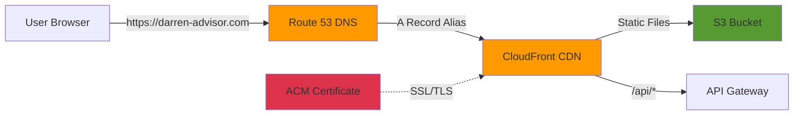

# Building Alex: Part 9 - Custom Domain with Route 53

You've deployed the full Alex stack to CloudFront, but your URL looks like `d2xacuj8kx2e3l.cloudfront.net`. In this guide, you'll register a custom domain (e.g., `darren-agentic-financial-advisor.click`) via AWS Route 53 and attach it to your CloudFront distribution with a free SSL certificate.

## What You're Building



**End Result**: Users visit `https://your-domain.com` instead of the ugly CloudFront URL.

## Cost Warning

> ⚠️ **Route 53 Domain Registration is NOT free.**
>
> - `.com` domains: **~$13/year**
> - `.net` domains: **~$11/year**
> - `.io` domains: **~$39/year**
> - `.dev` domains: **~$12/year**
> - Hosted Zone: **$0.50/month**
> - DNS queries: **$0.40 per million queries** (negligible)
> - ACM certificate: **FREE**
>
> Check current pricing at [Route 53 Pricing](https://aws.amazon.com/route53/pricing/).

## Prerequisites

Before starting, ensure you have:
- Completed Guides 1–7 (CloudFront distribution deployed and working)
- Your CloudFront distribution domain name (e.g., `d2xacuj8kx2e3l.cloudfront.net`)
- Your CloudFront distribution ID (e.g., `EK6IDEP723KK1`)
- A credit card linked to your AWS account (required for domain purchase)

To retrieve your CloudFront details:
```bash
# In alex/terraform/7_frontend directory
terraform output cloudfront_url
terraform state show aws_cloudfront_distribution.main | Select-String "id ="
# Example: d2xacuj8kx2e3l.cloudfront.net
```

---

## Step 1: Choose and Register Your Domain

### 1.1 Check Domain Availability

1. Sign in to the **AWS Console**
2. Navigate to **Route 53** (search "Route 53" in the top search bar)
3. In the left sidebar, click **Registered domains**
4. Click **Register domains**
5. In the search box, type your desired domain name (e.g., `darren-agentic-financial-advisor`)
6. Click **Search**

AWS will show you availability across extensions (`.com`, `.net`, `.org`, etc.) with prices.

**Tips for choosing a domain:**
- `.com` is the most recognizable and cheapest
- Keep it short and memorable
- Avoid hyphens if possible (but they're fine for course projects)
- Check multiple extensions if your first choice is taken

### 1.2 Register the Domain

1. Click **Select** next to your chosen domain
2. Click **Proceed to checkout**
3. Fill in the **Contact Details** form:
   - First Name, Last Name
   - Organization (optional — leave blank for personal)
   - Email (must be valid — AWS sends a verification email)
   - Phone number
   - Address
4. **Privacy Protection**: Enable it (free). This hides your personal details from WHOIS lookups
5. **Auto-Renew**: Disable if you only want this for the course project
6. Review the order and click **Submit**

### 1.3 Verify Your Email

- AWS sends a verification email to the address you provided
- **You must click the verification link within 15 days** or AWS suspends the domain
- Check your spam folder if you don't see it

### 1.4 Wait for Registration

- Most `.com` domains register in **5–15 minutes**
- Some exotic TLDs can take up to **48 hours**
- You'll see the status change from `Registration in progress` → `Active` under **Registered domains**

> **Note**: When you register a domain through Route 53, AWS **automatically creates a Hosted Zone** for it. This is the DNS configuration area where you'll add records in Step 3.

---

## Step 2: Request an SSL Certificate (ACM)

CloudFront requires an SSL certificate to serve your custom domain over HTTPS. AWS Certificate Manager (ACM) provides free certificates.

> ⚠️ **CRITICAL**: The certificate **must** be created in the **`us-east-1` (N. Virginia)** region. CloudFront only accepts certificates from `us-east-1`, regardless of where your other resources are deployed.

### 2.1 Switch to us-east-1

1. In the AWS Console, look at the **region selector** in the top-right corner
2. Click it and select **US East (N. Virginia) us-east-1**
3. Confirm you see `N. Virginia` displayed

### 2.2 Request the Certificate

1. Navigate to **AWS Certificate Manager** (search "ACM" or "Certificate Manager")
2. Click **Request a certificate**
3. Select **Request a public certificate** → Click **Next**
4. Under **Domain names**, add:
   - `your-domain.com` (your root domain)
   - `*.your-domain.com` (wildcard — covers `www.your-domain.com` and any future subdomains)
5. **Validation method**: Select **DNS validation** (recommended — it's automatic if you're using Route 53)
6. **Key algorithm**: Leave as **RSA 2048** (default)
7. Click **Request**

### 2.3 Validate the Certificate

Since your domain is in Route 53, validation is almost automatic:

1. After requesting, you'll see the certificate with status **Pending validation**
2. Click on the certificate ID to open its details
3. Under **Domains**, you'll see the CNAME records needed for validation
4. Click **Create records in Route 53**
5. AWS automatically adds the required CNAME validation records to your hosted zone
6. Click **Create records**

### 2.4 Wait for Validation

- With Route 53, validation usually completes in **2–10 minutes**
- Refresh the page until the status changes from `Pending validation` → **`Issued`**
- **Do not proceed until the certificate shows `Issued`**

### 2.5 Copy the Certificate ARN

1. Once the status says **Issued**, click on the certificate
2. Copy the **Certificate ARN** — it looks like:
   ```
   arn:aws:acm:us-east-1:864981739490:certificate/xxxxxxxx-xxxx-xxxx-xxxx-xxxxxxxxxxxx
   ```
3. Save this — you'll need it in the next step 3.3 and 7 (terraform to manage domain via code)
   ```
   arn:aws:acm:us-east-1:864981739490:certificate/1a55bec5-4af8-4650-a9bd-c09cac1b6249
   ```

---

## Step 3: Update CloudFront to Use Your Domain

Now you need to tell CloudFront to accept requests for your custom domain and use your SSL certificate.

### 3.1 Open CloudFront Settings

1. Navigate to **CloudFront** in the AWS Console
2. Click on your distribution (the one with domain `d2xacuj8kx2e3l.cloudfront.net`)
3. Click the **General** tab
4. Click **Edit**

### 3.2 Add Alternate Domain Names (CNAMEs)

1. In the **Alternate domain name (CNAME)** field, click **Add item**
2. Enter your domain: `your-domain.com`
3. Click **Add item** again
4. Enter: `www.your-domain.com`

### 3.3 Attach the SSL Certificate

1. Under **Custom SSL certificate**, click the dropdown
2. Select the certificate you just created (it should appear automatically since it's in `us-east-1`)
3. If it doesn't appear, ensure:
   - The certificate status is **Issued**
   - You created it in **us-east-1**
   - The domain names on the certificate match what you entered above

### 3.4 Save Changes

1. Leave all other settings as they are
2. Click **Save changes**
3. CloudFront will begin deploying the update — this takes **5–15 minutes**
4. The distribution status will show **Deploying** → **Enabled**

---

## Step 4: Create DNS Records in Route 53

Now point your domain to the CloudFront distribution.

### 4.1 Open Your Hosted Zone

1. Navigate to **Route 53** in the AWS Console
2. Click **Hosted zones** in the left sidebar
3. Click on your domain name (e.g., `your-domain.com`)

You'll see the existing NS (Name Server) and SOA records that were auto-created.

### 4.2 Create an A Record for the Root Domain

1. Click **Create record**
2. Configure:
   - **Record name**: Leave blank (this is the root domain `your-domain.com`)
   - **Record type**: **A – Routes traffic to an IPv4 address**
   - **Toggle on**: **Alias**
   - **Route traffic to**: Select **Alias to CloudFront distribution**
   - **Distribution**: Select your distribution from the dropdown (it should auto-populate based on the CNAME you added in Step 3)
   - **Routing policy**: Simple routing
3. Click **Create records**

### 4.3 Create an A Record for www Subdomain

1. Click **Create record** again
2. Configure:
   - **Record name**: `www`
   - **Record type**: **A – Routes traffic to an IPv4 address**
   - **Toggle on**: **Alias**
   - **Route traffic to**: Select **Alias to CloudFront distribution**
   - **Distribution**: Select the same distribution
   - **Routing policy**: Simple routing
3. Click **Create records**

### 4.4 Verify DNS Records

Your hosted zone should now have these records:

| Record Name | Type | Value |
| :--- | :--- | :--- |
| `your-domain.com` | NS | (auto-created name servers) |
| `your-domain.com` | SOA | (auto-created) |
| `your-domain.com` | A | Alias → CloudFront distribution |
| `www.your-domain.com` | A | Alias → CloudFront distribution |
| `_xxxxx.your-domain.com` | CNAME | (ACM validation record) |

---

## Step 5: Update CORS Configuration

Your Lambda currently only allows requests from `localhost:3000` and the CloudFront `*.cloudfront.net` domain. You need to add your custom domain.

### 5.1 Update Lambda Environment Variable (optional if we use allow=*)

1. Navigate to **Lambda** in the AWS Console
2. Click on the `alex-api` function
3. Go to **Configuration** → **Environment variables**
4. Click **Edit**
5. Find the `CORS_ORIGINS` variable
6. Update its value to include your new domain:
   ```
   http://localhost:3000, https://d2xacuj8kx2e3l.cloudfront.net, https://darren-agentic-financial-advisor.click, https://www.darren-agentic-financial-advisor.click
   ```
7. Click **Save**

### 5.2 Update Clerk Allowed Origins (Important!)

Your Clerk authentication also needs to know about the new domain:

1. Go to [Clerk Dashboard](https://dashboard.clerk.com)
2. Select your application
3. On top of page, click the toggle beside **Development** → **Create Production Instance** (Select Default, then add your `darren-agentic-financial-advisor.click` name)
4. Click Configure in the square box `Connect Domains` in the main page. It should show the DNS Configurations and those unverified.
   - To add the CNAME records to AWS Route 53 so Clerk can verify your domain, Go to AWS Console → Route 53 → Hosted zones and click your domain.
   - For each of the 5 records in your screenshot, do the following in AWS:
      1. Click Create record
      2. Record name: Paste the first part from Clerk (e.g., clerk, accounts, clkmail, etc. Use the little copy icon next to them).
      3. Record type: Change this to CNAME
      4. Value: Paste the second part from Clerk (e.g., frontend-api.clerk.services, etc.)
      5. Alias: Leave this toggled OFF
      6. Click Create records
   - Once you've created all 5 records in AWS, go back to that Clerk page and click the blue Verify configuration button.
5. Save

### 5.3 Redeploy in 7_frontend for production env in Clerk

### What to expect and next steps after adding all 5:

1.  **Verify**: In Clerk, click the blue **Verify configuration** button. It will turn from "Unverified" to "Verified" (you might need to wait a few minutes and click it again if DNS is slow).
2.  **Get New Keys**: Production uses entirely different keys. In the Clerk Dashboard (still in Production mode), go to **API Keys** and copy your new `Publishable Key` and `Secret Key`.
3.  **Update `.env` Files**: Replace the old Development Clerk keys with your new Production keys in both:
    *   `frontend/.env.local`
    *   root `.env`
4.  **Update Terraform Variables**: In `terraform/7_frontend/terraform.tfvars`, update your JWKS URL and Issuer to use your new custom domain instead of the `.dev` one.
    *   `clerk_issuer = "https://clerk.darren-agentic-financial-advisor.click"`
    *   `clerk_jwks_url = "https://clerk.darren-agentic-financial-advisor.click/.well-known/jwks.json"`
5.  **Run Final Deploy**: Since you changed environment variables, run your deployment script one last time to bake the new keys into your frontend and backend:
    ```powershell
    cd scripts
    uv run deploy.py
    ```

Once that's done, your app is fully secured and running on your production custom domain!

### 5.4 Next Steps (Optional)

### SSL Certificates
**Do nothing.** Since your DNS is now "Verified" (green badge), Clerk is automatically reaching out to a certificate authority (like Let's Encrypt) to generate the SSL certificates for its auth endpoints. It's fully automated. Just wait a few minutes and refresh the page.

### Social Auth (Google, GitHub, etc.)
In Development, Clerk uses shared "fake" credentials for Google login so you don't have to configure anything. In Production, they force you to use your own. 

**What to do:**
*   **If you only want Email/Password login:** Go to **Configure → User & authentication** in the left sidebar, click the gear icon next to Google, and disable it. The warning will disappear.
*   **If you want Google login to work:** You must go to the Google Cloud Console, create an OAuth Web Application, get the Client ID and Secret, and paste them into Clerk (under **Configure → User & authentication → Google → Settings**).

*(For this project, turning off Google and just using Email is the fastest path forward!)*

---

## Step 6: Test Your Custom Domain

### 6.1 Wait for DNS Propagation

DNS changes can take **5 minutes to 48 hours** to propagate globally. To check the current status:

```bash
# Check if DNS is resolving
nslookup darren-agentic-financial-advisor.click

# You should see it resolving to CloudFront IPs
# Something like: d2xacuj8kx2e3l.cloudfront.net
```

### 6.2 Test in Browser

1. Open `https://darren-agentic-financial-advisor.click` in your browser
2. Verify:
   - ✅ The page loads (not a CloudFront error)
   - ✅ The SSL padlock appears (certificate is working)
   - ✅ You can sign in with Clerk
   - ✅ API calls work (check Network tab in DevTools for `/api/*` requests)
   - ✅ `https://www.your-domain.com` also works

### 6.3 Common Issues

| Problem | Cause | Fix |
| :--- | :--- | :--- |
| `ERR_NAME_NOT_RESOLVED` | DNS hasn't propagated yet | Wait 5–30 minutes, then retry |
| `403 Forbidden` | CloudFront doesn't recognize the domain | Verify the CNAME was added in CloudFront Step 3.2 |
| `ERR_CERT_COMMON_NAME_INVALID` | Certificate doesn't match domain | Ensure ACM cert covers `your-domain.com` and `*.your-domain.com` |
| Sign-in redirects fail | Clerk doesn't know about the domain | Add domain to Clerk's allowed origins (Step 5.2) |
| API calls return CORS errors | Lambda CORS not updated | Update `CORS_ORIGINS` env var (Step 5.1) |

---

## Step 7: (Optional) Persist in Terraform

If you want your domain configuration managed as Infrastructure as Code (so `terraform apply` handles it), you can add the following to your `terraform/7_frontend/main.tf`. **This is optional** — the manual console steps above are sufficient for the course.

Add these resources after the existing `aws_cloudfront_distribution` block:

```hcl
# --- Custom Domain Resources (Optional) ---

# Variables to add to variables.tf:
# variable "custom_domain" {
#   description = "Custom domain name (e.g., darren-agentic-financial-advisor)"
#   type        = string
#   default     = ""
# }
#
# variable "acm_certificate_arn" {
#   description = "ACM certificate ARN (must be in us-east-1)"
#   type        = string
#   default     = ""
# }

# Route 53 Hosted Zone lookup (only if domain was registered via Route 53)
# data "aws_route53_zone" "main" {
#   count = var.custom_domain != "" ? 1 : 0
#   name  = var.custom_domain
# }

# A Record: root domain → CloudFront
# resource "aws_route53_record" "root" {
#   count   = var.custom_domain != "" ? 1 : 0
#   zone_id = data.aws_route53_zone.main[0].zone_id
#   name    = var.custom_domain
#   type    = "A"
#
#   alias {
#     name                   = aws_cloudfront_distribution.main.domain_name
#     zone_id                = aws_cloudfront_distribution.main.hosted_zone_id
#     evaluate_target_health = false
#   }
# }

# A Record: www subdomain → CloudFront
# resource "aws_route53_record" "www" {
#   count   = var.custom_domain != "" ? 1 : 0
#   zone_id = data.aws_route53_zone.main[0].zone_id
#   name    = "www.${var.custom_domain}"
#   type    = "A"
#
#   alias {
#     name                   = aws_cloudfront_distribution.main.domain_name
#     zone_id                = aws_cloudfront_distribution.main.hosted_zone_id
#     evaluate_target_health = false
#   }
# }
```

You would also need to update the `aws_cloudfront_distribution.main` block to include:
```hcl
  # Add inside the cloudfront_distribution resource:
  aliases = var.custom_domain != "" ? [var.custom_domain, "www.${var.custom_domain}"] : []

  viewer_certificate {
    cloudfront_default_certificate = var.custom_domain == ""
    acm_certificate_arn            = var.custom_domain != "" ? var.acm_certificate_arn : null
    ssl_support_method             = var.custom_domain != "" ? "sni-only" : null
    minimum_protocol_version       = var.custom_domain != "" ? "TLSv1.2_2021" : null
  }
```

---

## Step 8: Cleanup

If you decide you no longer need the custom domain:

### To Remove the Domain from CloudFront (keeps the domain):
1. CloudFront → Edit distribution → Remove CNAMEs → Switch back to default certificate → Save
2. Route 53 → Delete the A records you created (keep NS and SOA)
3. Lambda → Remove custom domains from `CORS_ORIGINS`

### To Cancel Domain Auto-Renewal:
1. Route 53 → **Registered domains** → Click your domain
2. Toggle **Auto-renew** to **Disabled**
3. The domain will expire at the end of the registration period

### To Delete the Hosted Zone (saves $0.50/month):
1. First delete all records you created (A records, CNAME validation records)
2. Route 53 → **Hosted zones** → Select zone → **Delete**
3. ⚠️ **Warning**: If you delete the hosted zone while the domain is still active, your site will go offline

### To Delete the ACM Certificate:
1. First remove it from CloudFront (Step above)
2. ACM → Select certificate → **Delete**

---

## Summary

| Step | Action | Time | Cost |
| :--- | :--- | :--- | :--- |
| 1 | Register domain in Route 53 | 5–15 min | ~$13/year (.com) |
| 2 | Request ACM certificate in us-east-1 | 2–10 min | Free |
| 3 | Update CloudFront with CNAME + certificate | 5–15 min | Free |
| 4 | Create A records in Route 53 | 2 min | Free |
| 5 | Update CORS + Clerk origins | 2 min | Free |
| 6 | Test and verify | 5 min | Free |

**Total time**: ~30 minutes (mostly waiting for propagation)
**Total cost**: ~$13/year for the domain + $0.50/month for hosted zone = **~$19/year**

After completing this guide, your application is live at `https://your-domain.com` — a professional, production-ready URL for your AI Financial Advisor. 🎉
